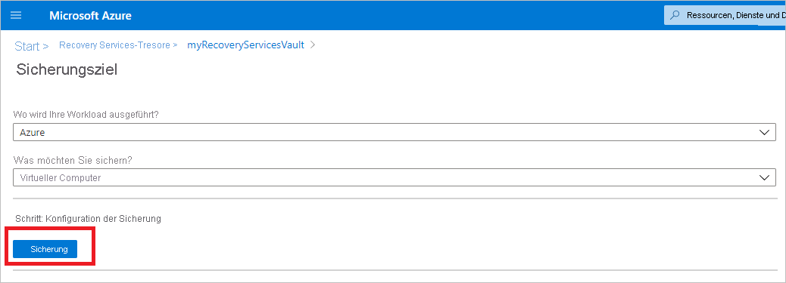
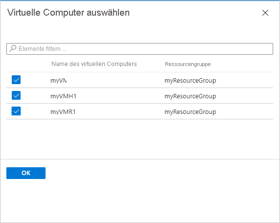
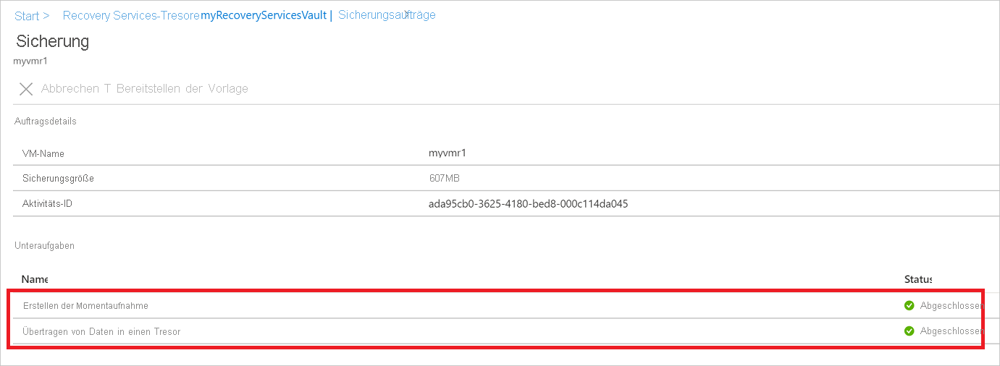

# <a name="back-up-azure-vms-in-a-recovery-services-vault"></a>Sichern virtueller Azure-Computer in einem Recovery Services-Tresor

In diesem Artikel wird beschrieben, wie virtuelle Azure-Computer mit dem [Azure Backup](backup-overview.md)-Dienst in einem Recovery Services-Tresor gesichert werden.

In diesem Artikel werden folgende Vorgehensweisen behandelt:

> [!div class="checklist"]
> * Vorbereiten von Azure-VMs
> * Erstellen eines Tresors.
> * Ermitteln Sie VMs, und konfigurieren Sie eine Sicherungsrichtlinie.
> * Aktivieren Sie die Sicherung für Azure-VMs.
> * Führen Sie die erste Sicherung durch.


> [!NOTE]
> In diesem Artikel wird beschrieben, wie Sie einen Tresor einrichten und zu sichernde VMs auswählen. Dies ist hilfreich, wenn Sie mehrere VMs sichern möchten. Alternativ können Sie [eine einzelne Azure-VM](backup-azure-vms-first-look-arm.md) direkt aus den VM-Einstellungen heraus sichern.

## <a name="before-you-start"></a>Vorbereitung


- [Überprüfen Sie](backup-architecture.md#architecture-direct-backup-of-azure-vms) die Architektur für die Azure-VM-Sicherung.
- [Erfahren Sie mehr](backup-azure-vms-introduction.md) über die Azure-VM-Sicherung und die Sicherungserweiterung.
- [Überprüfen Sie die Supportmatrix](backup-support-matrix-iaas.md), bevor Sie die Sicherung konfigurieren.

Darüber hinaus gibt es einige Schritte, die Sie in bestimmten Fällen möglicherweise ausführen müssen:

- **Installieren des VM-Agents auf dem virtuellen Computer:** Azure Backup sichert Azure-VMs durch die Installation einer Erweiterung für den Azure-VM-Agent auf dem Computer. Wenn Ihre VM aus einem Azure Marktplatz-Image erstellt wurde, ist der Agent installiert und aktiv. Wenn Sie eine benutzerdefinierte VM erstellen oder einen lokalen Computer migrieren, müssen Sie möglicherweise [den Agent manuell installieren](#install-the-vm-agent).
- **Explizites Zulassen von ausgehendem Zugriff:** Im Allgemeinen müssen Sie den ausgehenden Netzwerkzugriff für eine Azure-VM nicht explizit zulassen, damit sie mit Azure Backup kommunizieren kann. Bei einigen VMs können jedoch Verbindungsprobleme auftreten. Dann wird bei einem Verbindungsversuch der Fehler **ExtensionSnapshotFailedNoNetwork** angezeigt. In diesem Fall sollten Sie [ausgehenden Zugriff explizit zulassen](#explicitly-allow-outbound-access), damit die Azure Backup-Erweiterung mit öffentlichen IP-Adressen von Azure für den Sicherungsdatenverkehr kommunizieren kann.


## <a name="create-a-vault"></a>Erstellen eines Tresors

 Ein Tresor speichert Sicherungen und Wiederherstellungspunkte, die im Laufe der Zeit erstellt wurden, sowie Sicherungsrichtlinien, die zu gesicherten VMs gehören. Erstellen Sie wie folgt einen Tresor:

1. Melden Sie sich beim [Azure-Portal](https://portal.azure.com/) an.
2. Geben Sie in der Suche **Recovery Services** ein. Klicken Sie unter **Dienste** auf **Recovery Services-Tresore**.

      <br/>

3. Klicken Sie im Menü **Recovery Services-Tresore** auf **+ Hinzufügen**.

     

4. Geben Sie unter **Recovery Services-Tresor** einen Anzeigenamen ein, über den der Tresor identifiziert wird.
    - Der Name muss für das Azure-Abonnement eindeutig sein.
    - Er kann zwischen 2 bis 50 Zeichen enthalten.
    - Er muss mit einem Buchstaben beginnen und darf nur Buchstaben, Zahlen und Bindestriche enthalten.
5. Wählen Sie das Azure-Abonnement, die Ressourcengruppe und die geografische Region, in der der Tresor erstellt werden soll. Klicken Sie dann auf **Erstellen**.
    - Es kann eine Weile dauern, bis der Tresor fertiggestellt wird.
    - Verfolgen Sie die Statusbenachrichtigungen rechts oben im Portal.


 Nach Abschluss des Erstellungsvorgangs wird der Tresor in der Liste der Recovery Services-Tresore angezeigt. Sollte der Tresor nicht angezeigt werden, wählen Sie **Aktualisieren**.


### <a name="modify-storage-replication"></a>Ändern der Speicherreplikation

Tresore verwenden standardmäßig den [georedundanten Speicher (GRS)](https://docs.microsoft.com/azure/storage/common/storage-redundancy-grs).

- Wenn der Tresor Ihr Hauptmechanismus für Sicherungen ist, empfehlen wir die Verwendung von GRS.
- Sie können [Lokal redundanter Speicher (LRS)](https://docs.microsoft.com/azure/storage/common/storage-redundancy-lrs?toc=%2fazure%2fstorage%2fblobs%2ftoc.json) als kostengünstigere Option verwenden.

Passen Sie die Speicherreplikationstyp wie folgt an:

1. Klicken Sie im neuen Tresor im Abschnitt **Einstellungen** auf **Eigenschaften**.
2. Klicken Sie in **Eigenschaften** unter **Sicherungskonfiguration** auf **Aktualisieren**.
3. Wählen Sie den Speicherreplikationstyps aus, und klicken Sie auf **Speichern**.

      
> [!NOTE]
   > Sie können den Speichertyp für die Replikation nicht mehr ändern, nachdem der Tresor eingerichtet wurde und Sicherungselemente enthält. Dazu müssen Sie den Tresor neu erstellen.

## <a name="apply-a-backup-policy"></a>Anwenden einer Sicherungsrichtlinie

Konfigurieren Sie eine Sicherungsrichtlinie für den Tresor.

1. Klicken Sie im Tresor im Abschnitt **Übersicht** auf **+ Sicherung**.

   


2. Wählen Sie unter **Sicherungsziel** > **Wo wird Ihre Workload ausgeführt?** die Option **Azure** aus. Wählen Sie unter **Was möchten Sie sichern?** die Option **Virtueller Computer** >  **OK** aus. Dadurch wird die VM-Erweiterung im Tresor registriert.

   

3. Wählen Sie unter **Sicherungsrichtlinie** die Richtlinie aus, die dem Tresor zugeordnet werden soll.
    - Die Standardrichtlinie sichert den virtuellen Computer einmal täglich. Die täglichen Sicherungen werden 30 Tage lang aufbewahrt. Momentaufnahmen für die sofortige Wiederherstellung werden zwei Tage lang aufbewahrt.
    - Wenn Sie nicht die Standardrichtlinie verwenden möchten, wählen Sie **Neu erstellen** aus, und erstellen Sie eine benutzerdefinierte Richtlinie, wie im nächsten Verfahren beschrieben.

      

4. Wählen Sie unter **Virtuelle Computer auswählen** die VMs aus, die Sie mithilfe der Richtlinie sichern möchten. Klicken Sie dann auf **OK**.

   - Die ausgewählten VMs werden überprüft.
   - Sie können nur VMs auswählen, die sich in der gleichen Region wie der Tresor befinden.
   - VMs können nur in einem Tresor gesichert werden.

     

5. Klicken Sie unter **Sicherung** auf **Sicherung aktivieren**. Damit wird die Richtlinie für den Tresor und die VMs bereitgestellt, und die Sicherungserweiterung wird auf dem VM-Agent auf der Azure-VM installiert.

     

Nach dem Aktivieren der Sicherung:

- Die Sicherungserweiterung wird vom Sicherungsdienst unabhängig davon installiert, ob der virtuelle Computer ausgeführt wird oder nicht.
- Eine erste Sicherung wird gemäß Ihrem Sicherungszeitplan ausgeführt.
- Beachten Sie während der Ausführung von Sicherungen Folgendes:
    - Ein ausgeführter virtueller Computer bietet die größte Chance zum Erfassen eines anwendungskonsistenten Wiederherstellungspunkts.
    - Selbst wenn der virtuelle Computer ausgeschaltet ist, erfolgt jedoch eine Sicherung. Eine derartige VM wird als Offline-VM bezeichnet. In diesem Fall ist der Wiederherstellungspunkt absturzkonsistent.


### <a name="create-a-custom-policy"></a>Erstellen einer benutzerdefinierten Richtlinie

Wenn Sie ausgewählt haben, eine neue Sicherungsrichtlinie zu erstellen, geben Sie die Richtlinieneinstellungen an.

1. Geben Sie unter **Richtlinienname** einen aussagekräftigen Namen an.
2. Geben Sie unter **Sicherungszeitplan** an, wann Sicherungen erstellt werden sollen. Sie können tägliche oder wöchentliche Sicherungen für Azure-VMs erstellen.
2. Geben Sie unter **Sofortige Wiederherstellung** an, wie lange die Momentaufnahmen lokal für eine sofortige Wiederherstellung beibehalten werden sollen.
    - Bei der Wiederherstellung werden gesicherte Datenträger von virtuellen Computern aus dem Speicher über das Netzwerk an den Speicherort für die Wiederherstellung kopiert. Bei einer sofortigen Wiederherstellung können Sie lokal gespeicherte Momentaufnahmen, die bei einem Sicherungsauftrag erstellt wurden, nutzen, ohne warten zu müssen, bis die Sicherungsdaten in den Tresor übertragen werden.
    - Sie können Momentaufnahmen für die sofortige Wiederherstellung bis zu fünf Tage lang beibehalten. Die Standardeinstellung beträgt zwei Tage.
3. Geben Sie unter **Beibehaltungsdauer** an, wie lange die täglichen oder wöchentlichen Sicherungspunkte beibehalten werden sollen.
4. Geben Sie unter **Aufbewahrung für monatlichen Sicherungspunkt** an, ob eine monatliche Sicherung Ihrer täglichen oder wöchentlichen Sicherungen beibehalten werden soll.
5. Klicken Sie zum Speichern der Richtlinie auf **OK** .

    

> [!NOTE]
   > Azure Backup unterstützt keine automatische Uhrzeitanpassung an die Sommerzeit für die Sicherungen von Azure-VMs. Sicherungsrichtlinien können bei Bedarf – beispielsweise wenn zeitliche Änderungen auftreten – angepasst werden.

## <a name="trigger-the-initial-backup"></a>Auslösen der ersten Sicherung

Die erste Sicherung wird entsprechend dem festgelegten Zeitplan ausgeführt; Sie können sie aber auch mit den folgenden Schritten sofort ausführen:

1. Klicken Sie im Tresormenü auf **Sicherungselemente**.
2. Klicken Sie unter **Sicherungselemente** auf **Virtueller Azure-Computer**.
3. Klicken Sie in der Liste **Sicherungselemente** auf das Auslassungszeichen „(...)“.
4. Klicken Sie auf **Jetzt sichern**.
5. Verwenden Sie unter **Jetzt sichern** den Kalender, um den letzten Tag zur Beibehaltung des Wiederherstellungspunkts auszuwählen. Klicken Sie dann auf **OK**.
6. Überwachen Sie die Portalbenachrichtigungen. Sie können den Auftragsstatus im Dashboard des Tresors unter **Sicherungsaufträge** > **In Bearbeitung** überwachen. Je nach Größe Ihrer VM kann das Erstellen der ersten Sicherung einige Zeit dauern.

## <a name="verify-backup-job-status"></a>Überprüfen des Status des Sicherungsauftrags

Die Sicherungsauftragsdetails jeder VM-Sicherung umfassen zwei Phasen: die Phase **Momentaufnahme** und die Phase **Daten in Tresor übertragen**.<br/>
Die Momentaufnahmephase stellt sicher, dass ein Wiederherstellungspunkt vorhanden ist, der zusammen mit den Datenträgern für die **sofortige Wiederherstellung** gespeichert wird und maximal fünf Tage lang verfügbar ist (abhängig von der konfigurierten Aufbewahrungsdauer für Momentaufnahmen). In der Phase „Daten in Tresor übertragen“ wird zur langfristigen Aufbewahrung ein Wiederherstellungspunkt im Tresor erstellt. Die Übertragung von Daten in den Tresor beginnt erst nach Abschluss der Momentaufnahmephase.

  

Am Back-End werden zwei **Teilvorgänge** ausgeführt – einer davon für den Front-End-Sicherungsauftrag. Dieser kann auf dem Detailblatt für den **Sicherungsauftrag** überprüft werden, wie hier zu sehen:

  

Die Phase **Daten in Tresor übertragen** kann je nach Datenträgergröße, Änderungen pro Datenträger und verschiedenen anderen Faktoren mehrere Tage dauern.

Der Auftragsstatus kann abhängig von den folgenden Szenarien variieren:

**Momentaufnahme** | **Daten in Tresor übertragen** | **Auftragsstatus**
--- | --- | ---
Abgeschlossen | In Bearbeitung | In Bearbeitung
Abgeschlossen | Übersprungen | Abgeschlossen
Abgeschlossen | Abgeschlossen | Abgeschlossen
Abgeschlossen | Fehler | Mit Warnung abgeschlossen
Fehler | Fehler | Fehler


Mit dieser Funktion können nun zwei Sicherungen parallel für den gleichen virtuellen Computer ausgeführt werden. In jeder Phase („Momentaufnahme“ und „Daten in Tresor übertragen“) kann jedoch immer nur ein einzelner Teilvorgang ausgeführt werden. Durch diese Entkoppelung werden nun also Szenarien vermieden, in denen ein aktiver Sicherungsauftrag dazu führte, dass die Sicherung des Folgetags nicht erfolgreich war. Bei Sicherungen des Folgetags kann eine Momentaufnahme erstellt und **Daten in Tresor übertragen** übersprungen werden, falls ein Sicherungsauftrag des Vortags aktiv ist.
Der inkrementelle, im Tresor erstellte Wiederherstellungspunkt erfasst sämtliche Änderungen seit dem letzten Wiederherstellungspunkt, der im Tresor erstellt wurde. Dies hat keine Auswirkungen auf die Kosten des Benutzers.


## <a name="optional-steps-install-agentallow-outbound"></a>Optionale Schritte (Installieren des Agents/Zulassen von ausgehendem Datenverkehr)
### <a name="install-the-vm-agent"></a>Installieren des VM-Agents

Azure Backup sichert Azure-VMs durch die Installation einer Erweiterung für den Azure-VM-Agent auf dem Computer. Wenn Ihre VM aus einem Azure Marketplace-Image erstellt wurde, ist der Agent installiert und aktiv. Wenn Sie eine benutzerdefinierte VM erstellen oder einen lokalen Computer migrieren, müssen Sie den Agent möglicherweise manuell installieren, wie in der Tabelle veranschaulicht.

**VM** | **Details**
--- | ---
**Windows** | 1. [Laden Sie die Agent-MSI-Datei herunter, und installieren Sie sie](https://go.microsoft.com/fwlink/?LinkID=394789&clcid=0x409).<br/><br/> 2. Für die Installation benötigen Sie Administratorberechtigungen auf dem Computer.<br/><br/> 3. Überprüfen Sie die Installation. Klicken Sie auf der VM in *C:\WindowsAzure\Packages* mit der rechten Maustaste auf **WaAppAgent.exe** > **Eigenschaften**. Auf der Registerkarte **Details** sollte mindestens die **Produktversion** 2.6.1198.718 angegeben sein.<br/><br/> Wenn Sie den Agent aktualisieren, stellen Sie sicher, dass keine Sicherungsvorgänge ausgeführt werden, und [installieren Sie den Agent erneut](https://go.microsoft.com/fwlink/?LinkID=394789&clcid=0x409).
**Linux** | Führen Sie die Installation mit einem RPM- oder DEB-Paket aus dem Paketrepository der Distribution durch. Dies ist die bevorzugte Methode zum Installieren und Aktualisieren des Azure Linux-Agents. Das Azure Linux-Agent-Paket wird von allen [unterstützten Distributionsanbietern](https://docs.microsoft.com/azure/virtual-machines/linux/endorsed-distros) in ihre jeweiligen Images und Repositorys integriert. Der Agent steht auf [GitHub](https://github.com/Azure/WALinuxAgent) zur Verfügung, jedoch wird die Installation über GitHub nicht empfohlen.<br/><br/> Wenn Sie den Agent aktualisieren, stellen Sie sicher, dass keine Sicherungsvorgänge ausgeführt werden, und aktualisieren Sie die Binärdateien.

### <a name="explicitly-allow-outbound-access"></a>Explizites Erlauben von ausgehenden Zugriffen

Die auf der VM ausgeführte Sicherungserweiterung erfordert ausgehenden Zugriff auf öffentliche Azure-IP-Adressen.

- Im Allgemeinen müssen Sie den ausgehenden Netzwerkzugriff für eine Azure-VM nicht explizit zulassen, damit sie mit Azure Backup kommunizieren kann.
- Wenn beim Verbinden von VMs Probleme auftreten oder beim Verbindungsaufbau der Fehler **ExtensionSnapshotFailedNoNetwork** ausgegeben wird, sollten Sie den Zugriff explizit zulassen, damit die Sicherungserweiterung für den Sicherungsdatenverkehr mit öffentlichen Azure-IP-Adressen kommunizieren kann. Die Zugriffsmethoden werden in der folgenden Tabelle zusammengefasst.


**Option** | **Aktion** | **Details**
--- | --- | ---
**NSG-Regeln einrichten** | Lassen Sie die [IP-Bereiche des Azure-Rechenzentrums](https://www.microsoft.com/download/details.aspx?id=41653) zu.<br/><br/> Sie können eine Regel hinzufügen, die den Zugriff auf den Azure Backup-Dienst mithilfe eines [Diensttags](backup-azure-arm-vms-prepare.md#set-up-an-nsg-rule-to-allow-outbound-access-to-azure) zulässt, anstatt jeden Adressbereich zuzulassen und zu verwalten. | [Erfahren Sie mehr](../virtual-network/security-overview.md#service-tags) über Diensttags.<br/><br/> Diensttags vereinfachen die Zugriffsverwaltung und verursachen keine zusätzlichen Kosten.
**Proxy bereitstellen** | Stellen Sie einen HTTP-Proxyserver zum Weiterleiten des Datenverkehrs bereit. | Ermöglicht den Zugriff auf Azure insgesamt, nicht nur auf den Speicher.<br/><br/> Die Feinsteuerung über die Speicher-URLs ist möglich.<br/><br/> Zentraler Punkt für Internetzugriff auf virtuelle Computer.<br/><br/> Zusätzliche Kosten für den Proxy.
**Azure Firewall einrichten** | Lassen Sie auf dem virtuellen Computer den Datenverkehr über Azure Firewall mithilfe eines FQDN-Tags für den Azure Backup-Dienst zu. | Einfach zu verwenden, wenn Azure Firewall in einem VNET-Subnetz eingerichtet ist.<br/><br/> Es können keine eigenen FQDN-Tags erstellt werden, und die FQDNs in einem Tag können nicht geändert werden.<br/><br/> Wenn Sie verwaltete Azure-Datenträger verwenden, müssen Sie in den Firewalls möglicherweise einen weiteren Port (8443) öffnen.

#### <a name="establish-network-connectivity"></a>Herstellen der Netzwerkverbindung

Herstellen von Konnektivität mit der NSG per Proxy oder über die Firewall

##### <a name="set-up-an-nsg-rule-to-allow-outbound-access-to-azure"></a>Einrichten einer NSG-Regel (Netzwerksicherheitsgruppe) zum Zulassen des ausgehenden Zugriffs auf Azure

Wenn eine NSG den VM-Zugriff verwaltet, lassen Sie den ausgehenden Zugriff auf die erforderlichen Bereiche und Ports für den Sicherungsspeicher zu.

1. Wählen Sie in den VM-Eigenschaften unter **Netzwerk** die Option **Regel für ausgehenden Port hinzufügen** aus.
2. Wählen Sie unter **Ausgangssicherheitsregel hinzufügen** die Option **Erweitert** aus.
3. Wählen Sie im Feld **Quelle** den Eintrag **VirtualNetwork** aus.
4. Geben Sie für **Quellportbereiche** ein Sternchen (*) ein, um ausgehenden Zugriff über alle Ports zuzulassen.
5. Wählen Sie **Diensttag** als **Ziel** aus. Wählen Sie **Storage.region** aus der Liste aus. Wählen Sie dabei die Region aus, in der sich der Tresor und die zu sichernden VMs befinden.
6. Wählen Sie unter **Zielportbereiche** den entsprechenden Port aus.
    - Für nicht verwaltete VMs mit nicht verschlüsseltem Speicherkonto: 80
    - Für nicht verwaltete VMs mit verschlüsseltem Speicherkonto: 443 (Standardeinstellung)
    - Für verwaltete VMs: 8443
7. Wählen Sie für **Protokoll** die Option **TCP** aus.
8. Geben Sie unter **Priorität** einen Prioritätswert an, der geringer als alle höheren Ablehnungsregeln ist.

   Wenn Sie über eine Regel verfügen, die den Zugriff verweigert, muss die neue Zulassungsregel höhergestellt werden. Wenn Sie beispielsweise über eine **Deny_All**-Regel mit der Priorität 1.000 verfügen, muss für Ihre neue Regel ein Wert unter 1.000 festgelegt werden.
9. Geben Sie einen Namen und eine Beschreibung für die Regel ein, und wählen Sie **OK** aus.

Sie können die NSG-Regel auf mehrere VMs anwenden, um ausgehenden Zugriff zu erlauben. Dieses Video führt Sie durch diesen Prozess.

>[!VIDEO https://www.youtube.com/embed/1EjLQtbKm1M]


##### <a name="route-backup-traffic-through-a-proxy"></a>Routen des Sicherungsdatenverkehrs über einen Proxy

Sie können den Sicherungsdatenverkehr über ein Proxy routen und dem Proxy dann den Zugriff auf die erforderlichen Azure-Bereiche gewähren. Konfigurieren Sie die Proxy-VM, um Folgendes zuzulassen:

- Die Azure-VM sollte jeglichen HTTP-Datenverkehr an das öffentliche Internet über den Proxy routen.
- Der Proxy sollte jeglichen eingehenden Datenverkehr von VMs im entsprechenden virtuellen Netzwerk zulassen.
- Die NSG **NSF-lockdown** benötigt eine Regel, die ausgehenden Internetdatenverkehr vom virtuellen Proxy-Computer zulässt.

###### <a name="set-up-the-proxy"></a>Einrichten des Proxys

Wenn Sie über keinen Proxy für das Systemkonto verfügen, richten Sie wie folgt einen ein:

1. Laden Sie [PsExec](https://technet.microsoft.com/sysinternals/bb897553) herunter.
2. Führen Sie den Befehl **PsExec.exe -i -s cmd.exe** aus, um die Eingabeaufforderung mit einem Systemkonto auszuführen.
3. Führen Sie den Browser im Systemkontext aus. Beispiel: Verwenden Sie **%PROGRAMFILES%\Internet Explorer\iexplore.exe** für Internet Explorer.  
4. Definieren Sie die Proxyeinstellungen.
   - Unter Linux:
     - Fügen Sie die folgende Zeile in die Datei **/etc/environment** ein:
       - **http_proxy=http:\//proxy IP address:proxy port**
     - Fügen Sie die folgenden Zeilen in die Datei **/etc/waagent.conf** ein:
         - **HttpProxy.Host=proxy IP address**
         - **HttpProxy.Port=proxy port**
   - Legen Sie unter Windows in den Browsereinstellungen fest, dass ein Proxy verwendet werden soll. Wenn Sie derzeit einen Proxy für ein Benutzerkonto verwenden, können Sie mithilfe des folgenden Skripts die Einstellung auf Systemkontoebene anwenden.
       ```powershell
      $obj = Get-ItemProperty -Path Registry::"HKEY_CURRENT_USER\Software\Microsoft\Windows\CurrentVersion\Internet Settings\Connections"
      Set-ItemProperty -Path Registry::"HKEY_USERS\S-1-5-18\Software\Microsoft\Windows\CurrentVersion\Internet Settings\Connections" -Name DefaultConnectionSettings -Value $obj.DefaultConnectionSettings
      Set-ItemProperty -Path Registry::"HKEY_USERS\S-1-5-18\Software\Microsoft\Windows\CurrentVersion\Internet Settings\Connections" -Name SavedLegacySettings -Value $obj.SavedLegacySettings
      $obj = Get-ItemProperty -Path Registry::"HKEY_CURRENT_USER\Software\Microsoft\Windows\CurrentVersion\Internet Settings"
      Set-ItemProperty -Path Registry::"HKEY_USERS\S-1-5-18\Software\Microsoft\Windows\CurrentVersion\Internet Settings" -Name ProxyEnable -Value $obj.ProxyEnable
      Set-ItemProperty -Path Registry::"HKEY_USERS\S-1-5-18\Software\Microsoft\Windows\CurrentVersion\Internet Settings" -Name Proxyserver -Value $obj.Proxyserver

       ```

###### <a name="allow-incoming-connections-on-the-proxy"></a>Zulassen von eingehenden Verbindungen über den Proxy

Lassen Sie eingehende Verbindungen in den Proxyeinstellungen zu.

1. Öffnen Sie in Windows Firewall **Windows Firewall mit erweiterter Sicherheit**.
2. Klicken Sie mit der rechten Maustaste auf **Eingangsregeln** > **Neue Regel**.
3. Wählen Sie unter **Regeltyp** die Option **Benutzerdefiniert** > **Weiter** aus.
4. Klicken Sie unter **Programm** auf **Alle Programme** > **Weiter**.
5. In **Protokolle und Ports**:
   - Legen Sie für den Typ **TCP** fest.
   - Legen Sie für **Lokale Ports** die Option **Bestimmte Ports** fest.
   - Legen Sie **Remoteport** auf **Alle Ports** fest.

6. Beenden Sie den Assistenten, und legen Sie einen Namen für die Regel fest.

###### <a name="add-an-exception-rule-to-the-nsg-for-the-proxy"></a>Hinzufügen einer Ausnahmeregel zur NSG für den Proxy

Lassen Sie für die NSG **NSF-lockdown** den Datenverkehr über alle Ports unter 10.0.0.5 an alle Internetadressen über Port 80 (HTTP) oder 443 (HTTPS) zu.

Das folgende PowerShell-Skript enthält ein Beispiel zum Zulassen des Datenverkehrs.
Anstatt den ausgehenden Datenverkehr an alle öffentlichen Internetadressen zuzulassen, können Sie einen IP-Adressbereich (`-DestinationPortRange`) festlegen oder das Diensttag „storage.region“ verwenden.   

```powershell
Get-AzureNetworkSecurityGroup -Name "NSG-lockdown" |
Set-AzureNetworkSecurityRule -Name "allow-proxy " -Action Allow -Protocol TCP -Type Outbound -Priority 200 -SourceAddressPrefix "10.0.0.5/32" -SourcePortRange "*" -DestinationAddressPrefix Internet -DestinationPortRange "80-443"
```

##### <a name="allow-firewall-access-with-an-fqdn-tag"></a>Zulassen des Firewallzugriffs mit einem FQDN-Tag

Sie können Azure Firewall so konfigurieren, dass der ausgehende Zugriff für Netzwerkdatenverkehr an Azure Backup zugelassen wird.

- [Weitere Informationen](https://docs.microsoft.com/azure/firewall/tutorial-firewall-deploy-portal) zum Bereitstellen von Azure Firewall.
- [Erfahren Sie mehr](https://docs.microsoft.com/azure/firewall/fqdn-tags) über FQDN-Tags.


## <a name="next-steps"></a>Nächste Schritte

- Beheben von Problemen mit [Azure-VM-Agents](backup-azure-troubleshoot-vm-backup-fails-snapshot-timeout.md) oder [Azure-VM-Sicherungen](backup-azure-vms-troubleshoot.md).
- [Wiederherstellen](backup-azure-arm-restore-vms.md) virtueller Azure-Computer.
