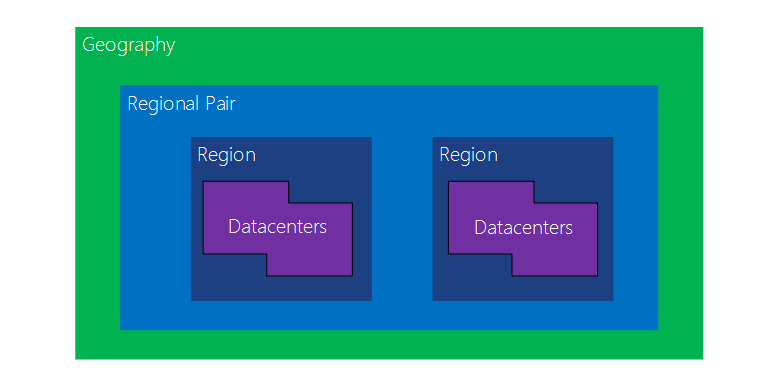

# Business Continuity & Disaster Recovery (BCDR): Azure-Regionspaare

## Was sind Regionspaare?

Azure betreibt Datencenter in mehreren Gebieten auf der ganzen Erde. Bei einem Azure-Gebiet handelt es sich um einen definierten Bereich der Erde, der mindestens eine Azure-Region enthält. Eine Azure-Region ist ein Bereich in einem Gebiet mit mindestens einem Rechenzentrum.

Jeder Azure-Region ist innerhalb des gleichen geografischen Gebiets eine andere Region als Regionspartner zugeordnet. Einzige Ausnahme ist „Brasilien, Süden“: Dieser Region ist eine Region außerhalb des geografischen Gebiets zugeordnet. Azure serialisiert Plattformupdates (geplante Wartung) für Regionspaare, sodass immer nur jeweils eine Region pro Paar aktualisiert wird. Bei einem Ausfall, der sich auf mehrere Regionen auswirkt, wird mindestens eine Region in jedem Paar für die Wiederherstellung priorisiert.

Abbildung 1: Azure-Regionspaare

| Gebiet | Regionspaare |  |
|:--- |:--- |:--- |
| Asien |Asien, Osten |Asien, Südosten |
| Australien |Australien (Osten) |Australien, Südosten |
| Australien |Australien, Mitte |Australien, Mitte 2 |
| Brasilien |Brasilien Süd |USA Süd Mitte |
| Kanada |Kanada, Mitte |Kanada, Osten |
| China |China, Norden |China, Osten|
| China |China, Norden 2 |China, Osten 2|
| Europa |Europa, Norden (Irland) |Europa, Westen (Niederlande) |
| Frankreich |Frankreich, Mitte|Frankreich, Süden|
| Deutschland |Deutschland, Mitte |Deutschland, Nordosten |
| Indien |Indien, Mitte |Indien (Süden) |
| Indien |Indien, Westen |Indien (Süden) |
| Japan |Japan, Osten |Japan, Westen |
| Korea |Korea, Mitte |Korea, Süden |
| Nordamerika |USA (Ost) |USA (Westen) |
| Nordamerika |USA (Ost) 2 |USA (Mitte) |
| Nordamerika |USA Nord Mitte |USA Süd Mitte |
| Nordamerika |USA, Westen 2 |USA, Westen-Mitte 
| Südafrika | Südafrika, Norden | Südafrika, Westen
| UK |UK, Westen |UK, Süden |
| Vereinigte Arabische Emirate | Vereinigte Arabische Emirate, Norden | VAE, Mitte
| US-Verteidigungsministerium |US DoD, Osten |US DoD, Mitte |
| US Government |US Gov Arizona |US Gov Texas |
| US Government |US Gov Iowa |US Government, Virginia |
| US Government |US Government, Virginia |US Gov Texas |

Tabelle 1: Übersicht über Azure-Regionspaare

- „Indien, Westen“ wird nur in einer Richtung zugeordnet. Die sekundäre Region von Indien (Westen) ist Indien (Süden), aber die sekundäre Region für Indien (Süden) ist Indien (Mitte).
- „Brasilien (Süden)“ ist einzigartig, da diese Region ein Paar mit einer Region außerhalb der eigenen Geografie bildet. Die sekundäre Region von „Brasilien, Süden“ ist „USA, Süden-Mitte“. Die sekundäre Region von „USA, Süden-Mitte“ ist nicht „Brasilien, Süden“.
- Die sekundäre Region von „USA Gov Iowa“ ist „USA Gov Virginia“.
- Die sekundäre Region von „USA Gov Virginia“ ist „USA Gov Texas“.
- Die sekundäre Region von „USA Gov Texas“ ist „USA Gov Arizona“.

Wir empfehlen das Konfigurieren von Business Continuity Disaster Recovery (BCDR) zwischen Regionalpaaren, um von Richtlinien für Isolierung und Verfügbarkeit von Azure zu profitieren. Bei Anwendungen, die mehrere aktive Regionen unterstützen, empfehlen wir nach Möglichkeit die Verwendung beider Regionen in einem Regionspaar. Dadurch wird eine optimale Verfügbarkeit für Anwendungen und eine minimierte Wiederherstellungszeit in einem Notfall sichergestellt. 

## Beispiel für ein Regionspaar
Abbildung 2 zeigt eine hypothetische Anwendung, die das Regionspaar für die Notfallwiederherstellung verwendet. Die grünen Zahlen markieren die regionsübergreifenden Aktivitäten von drei Azure-Diensten (Azure Compute, Storage und Database) und ihre Konfiguration für eine regionsübergreifende Replikation. Die eindeutigen Vorteile einer Bereitstellung in Regionspaaren werden von den orangefarbenen Zahlen hervorgehoben.

Abbildung 2 – Hypothetisches Azure-Regionspaar

## Regionsübergreifende Aktivitäten
Wie in Abbildung 2 dargestellt.

**Azure Compute (IaaS)** – Sie müssen zusätzliche Computeressourcen im Voraus bereitstellen, um sicherzustellen, dass Ressourcen während eines Notfalls in einer anderen Region zur Verfügung stehen. Weitere Informationen finden Sie unter [Technischer Leitfaden zur Resilienz in Azure](resiliency/resiliency-technical-guidance.md).

**Azure Storage** – georedundanter Speicher (GRS) wird beim Erstellen eines Azure Storage-Kontos standardmäßig konfiguriert. Mithilfe von GRS werden Ihre Daten dreimal in der primären Region und dreimal im Regionspaar automatisch repliziert. Weitere Informationen finden Sie unter [Redundanzoptionen für Azure Storage](storage/common/storage-redundancy.md).

 **Azure SQL Datenbank** – Mit der Georeplikation von Azure SQL-Datenbank können Sie die asynchrone Replikation von Transaktionen in jede Region der Welt konfigurieren. Es wird jedoch empfohlen, diese Ressourcen für die meisten Notfallwiederherstellungsszenarien in einem Regionspaar bereitzustellen. Weitere Informationen finden Sie unter [Georeplikation in Azure SQL-Datenbank](sql-database/sql-database-geo-replication-overview.md).

 **Azure Resource Manager (ARM)** : ARM bietet grundsätzlich eine regionsübergreifende logische Isolierung von Dienstverwaltungskomponenten. Dies bedeutet, dass sich logische Fehler in einer Region weniger wahrscheinlich auf eine andere auswirken.

## Vorteile eines Regionspaars
Wie in Abbildung 2 dargestellt.  

**Physische Isolierung** – zwischen Azure-Rechenzentren in einem Regionspaar sollte nach Möglichkeit eine Entfernung von mindestens 480 km bestehen, was allerdings nicht in allen Gebieten zweckmäßig oder möglich ist. Durch die Trennung physischer Datencenter wird die Wahrscheinlichkeit einer gleichzeitigen Beeinträchtigung beider Regionen durch Naturkatastrophen, politische Unruhen, Stromausfälle oder physische Netzwerkausfälle verringert. Die Isolierung unterliegt den Einschränkungen des jeweiligen Gebiets (Größe, Verfügbarkeit der Energieversorgungs-/Netzwerkinfrastruktur, Vorschriften usw.).  

**Von der Plattform bereitgestellte Replikation** – einige Dienste, wie z.B. georedundanter Speicher, bieten eine automatische Replikation in das Regionspaar.

**Reihenfolge der Regionswiederherstellung** – im Falle eines umfassenden Ausfalls hat bei jedem Paar die Wiederherstellung einer der Regionen Priorität. Für Anwendungen, die in Regionspaaren bereitgestellt sind, wird die priorisierte Wiederherstellung einer der Regionen garantiert. Wenn eine Anwendung in Regionen bereitgestellt ist, die kein Paar bilden, kann sich die Wiederherstellung verzögern. Im schlimmsten Fall werden die gewählten Regionen ggf. zuletzt wiederhergestellt.

**Sequenzielle Updates** – geplante Azure-Systemupdates werden zur Minimierung von Ausfallzeit, der Auswirkungen von Fehlern und logischen Ausfällen im seltenen Fall eines fehlerhaften Updates sequenziell (nicht gleichzeitig) eingespielt.

**Speicherort von Daten** – eine Region befindet sich innerhalb des gleichen Gebiets wie ihr Paar (mit Ausnahme von Brasilien, Süden), um steuerliche und rechtliche Anforderungen an den Speicherort von Daten zu erfüllen.
