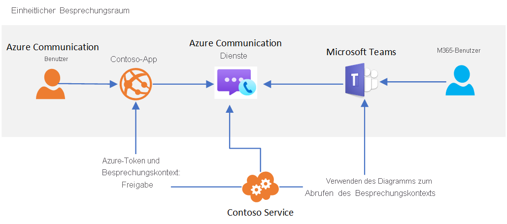

# Teams-Interoperabilität

[!INCLUDE [Private Preview Notice](../includes/private-preview-include.md)]

Azure Communication Services kann dazu verwendet werden, benutzerdefinierte Besprechungsumgebungen zu erstellen, die mit Microsoft Teams interagieren. Benutzer Ihrer Communication Services-Lösung(en) können mit den Teams-Teilnehmern über Sprache, Video und Bildschirmfreigabe interagieren.

Diese Interoperabilität ermöglicht es Ihnen, benutzerdefinierte Azure-Anwendungen zu erstellen, die Verbindungen zwischen Benutzern und Teams-Besprechungen herstellen. Benutzer Ihrer benutzerdefinierten Anwendungen müssen keine Azure Active Directory-Identitäten oder Teams-Lizenzen besitzen, um diese Funktion nutzen zu können. Dies ist ideal, um Mitarbeiter (die möglicherweise mit Teams vertraut sind) und externe Benutzer (mithilfe einer benutzerdefinierten Anwendungsumgebung) in einer reibungslosen Besprechungsumgebung zusammenzubringen. Auf diese Weise können Sie Umgebungen erstellen, die den folgenden ähnlich sind:

1. Mitarbeiter verwenden Teams zur Planung einer Besprechung
2. Ihre benutzerdefinierte Communication Services-Anwendung verwendet die Microsoft Graph-APIs für den Zugriff auf Besprechungsdetails
3. Besprechungsdetails werden über Ihre benutzerdefinierte Anwendung für externe Benutzer freigegeben
4. Externe Benutzer verwenden Ihre benutzerdefinierte Anwendung, um an der Teams-Besprechung teilzunehmen (über die Clientbibliothek für Communication Services-Telefonie)

Die allgemeine Architektur für diesen Anwendungsfall sieht folgendermaßen aus: 

Obwohl bestimmte Features für Teams-Besprechungen, z. B. Heben der Hand, Together-Modus und Breakout Rooms nur für Benutzer von Teams verfügbar sind, hat Ihre benutzerdefinierte Anwendung Zugriff auf die wichtigsten Funktionen für Audio, Video und Bildschirmfreigabe der Besprechung.

Wenn ein Communication Services-Benutzer an der Teams-Besprechung teilnimmt, wird der Anzeigename, der über die Clientbibliothek für Telefonie bereitgestellt wird, den Teams-Benutzern angezeigt. Der Communication Services-Benutzer wird ansonsten wie ein anonymer Benutzer in Teams behandelt. Ihre benutzerdefinierte Anwendung sollte die Benutzerauthentifizierung und andere Sicherheitsmaßnahmen zum Schutz von Teams-Besprechungen berücksichtigen. Seien Sie sich der Auswirkungen auf die Sicherheit bewusst, wenn Sie anonymen Benutzern die Teilnahme an Besprechungen ermöglichen, und verwenden Sie den [Teams-Sicherheitsleitfaden](/microsoftteams/teams-security-guide#addressing-threats-to-teams-meetings), um die für anonyme Benutzer verfügbaren Funktionen zu konfigurieren.

Communication Services-Benutzer können an geplanten Teams-Besprechungen teilnehmen, solange in den [Besprechungseinstellungen](/microsoftteams/meeting-settings-in-teams) die anonyme Teilnahme aktiviert ist.

## Teams in Government-Clouds (GCC)
Für Teams-Bereitstellungen mit [Microsoft 365-Government-Clouds (GCC)](/MicrosoftTeams/plan-for-government-gcc) wird derzeit keine Azure Communication Services-Interoperabilität zugelassen. 

## Nächste Schritte

> [!div class="nextstepaction"]
> [Beitreten mit einer Telefonie-App zu einer Teams-Besprechung](../quickstarts/voice-video-calling/get-started-teams-interop.md)