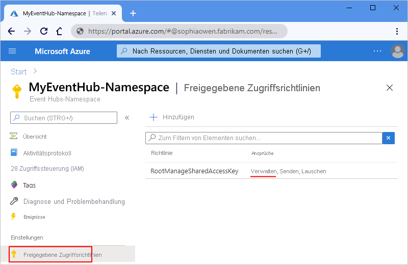
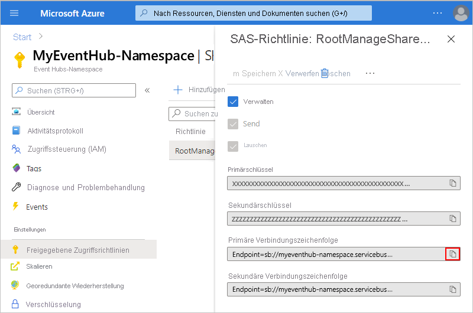
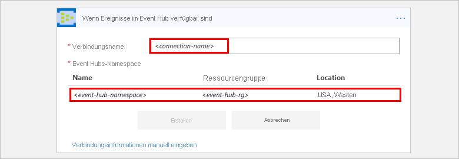
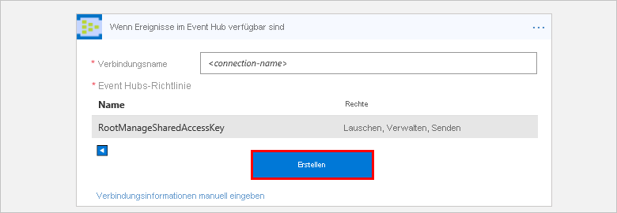

# Überwachen, Erhalten und Senden von Ereignissen mit Azure Event Hubs und Azure Logic Apps

In diesem Artikel wird gezeigt, wie Sie Ereignisse überwachen und verwalten können, die mit dem Azure Event Hubs-Connector aus einer Logik-App heraus an [Azure Event Hubs](../event-hubs/event-hubs-what-is-event-hubs.md) gesendet werden. Auf diese Weise können Sie Logik-Apps erstellen, die Aufgaben und Workflows zum Überprüfen, Senden und Empfangen von Ereignissen aus Ihrem Event Hub automatisieren. Connectorspezifische technische Informationen finden Sie in der [Referenz zum Azure Event Hubs-Connector](https://docs.microsoft.com/connectors/eventhubs/)</a>.

## Voraussetzungen

* Ein Azure-Abonnement. Wenn Sie nicht über ein Azure-Abonnement verfügen, können Sie sich [für ein kostenloses Azure-Konto registrieren](https://azure.microsoft.com/free/). 

* Einen [Azure Event Hubs-Namespace und Event Hub](../event-hubs/event-hubs-create.md)

* Die Logik-App, in der Sie auf Ihren Event Hub zugreifen möchten. Um Ihre Logik-App mit einem Azure Event Hubs-Trigger starten zu können, benötigen Sie eine [leere Logik-App](../logic-apps/quickstart-create-first-logic-app-workflow.md).
Falls Sie noch nicht mit Logik-Apps vertraut sind, finden Sie weitere Informationen unter [Was ist Azure Logic Apps?](../logic-apps/logic-apps-overview.md) und [Schnellstart: Erstellen Ihres ersten automatisierten Workflows mit Azure Logic Apps – Azure-Portal](../logic-apps/quickstart-create-first-logic-app-workflow.md).

## Überprüfen der Berechtigungen und Abrufen der Verbindungszeichenfolge

Damit Ihre Logik-App auf Ihren Event Hub zugreifen kann, überprüfen Sie Ihre Berechtigungen, und rufen Sie die Verbindungszeichenfolge für Ihren Event Hubs-Namespace ab.

1. Melden Sie sich beim [Azure-Portal](https://portal.azure.com) an.

1. Navigieren Sie zu Ihrem Event Hubs-*Namespace*, jedoch nicht zum eigentlichen Event Hub. 

1. Wählen Sie im Menü „Namespace“ unter **Einstellungen** die Option **Freigegebene Zugriffsrichtlinien** aus. Stellen Sie im Bereich **Ansprüche** sicher, dass Sie die **Verwaltungsberechtigungen** für diesen Namespace besitzen.

   

1. Wenn Sie die Verbindungsinformationen später manuell eingeben möchten, rufen Sie die Verbindungszeichenfolge für Ihren Event Hubs-Namespace ab.

   1. Wählen Sie unter **Richtlinie** die Option **RootManageSharedAccessKey**.

   1. Suchen Sie die Verbindungszeichenfolge des Primärschlüssels. Wählen Sie die Schaltfläche „Kopieren“, und speichern Sie die Verbindungszeichenfolge zur späteren Verwendung.

      

      > [!TIP]
      > Um zu überprüfen, ob Ihre Verbindungszeichenfolge Ihrem Event Hubs-Namespace oder einem bestimmten Event Hub zugeordnet ist, stellen Sie sicher, dass die Verbindungszeichenfolge nicht den Parameter `EntityPath` enthält. Wenn Sie diesen Parameter gefunden haben, gilt die Verbindungszeichenfolge für eine bestimmte Event Hub-Entität und stellt nicht die richtige Zeichenfolge für die Verwendung mit Ihrer Logik-App dar.

1. Fahren Sie jetzt mit [Hinzufügen eines Event Hubs-Triggers](#add-trigger) oder [Hinzufügen einer Event Hubs-Aktion](#add-action) fort.

## Hinzufügen des Event Hubs-Triggers

In Azure Logic Apps muss jede Logik-App mit einem [Trigger](../logic-apps/logic-apps-overview.md#logic-app-concepts) beginnen, der ausgelöst wird, wenn ein bestimmtes Ereignis eintritt oder eine bestimmte Bedingung erfüllt wird. Bei jeder Auslösung des Triggers erstellt das Logic Apps-Modul eine Logik-App-Instanz und startet die Ausführung des Workflows Ihrer App.

Dieses Beispiel zeigt, wie Sie einen Logik-App-Workflow starten können, wenn neue Ereignisse an Ihren Event Hub gesendet werden. 

1. Erstellen Sie im Azure-Portal oder in Visual Studio eine leere Logik-App, die den Logic Apps-Designer öffnet. In diesem Beispiel wird das Azure-Portal verwendet.

1. Geben Sie im Suchfeld „Event Hubs“ als Filter ein. Wählen Sie in der Triggerliste den folgenden Trigger aus: **Wenn Ereignisse im Event Hub verfügbar sind – Event Hubs**

   

1. Wenn Sie zur Angabe von Verbindungsdetails aufgefordert werden, [erstellen Sie jetzt Ihre Event Hubs-Verbindung](#create-connection). 

1. Stellen Sie im Trigger Informationen zum Event Hub bereit, den Sie überwachen möchten. Öffnen Sie die Liste **Neuen Parameter hinzufügen**, um weitere Eigenschaften anzuzeigen. Durch die Auswahl eines Parameters wird diese Eigenschaft der Triggerkarte hinzugefügt.

   

   | Eigenschaft | Erforderlich | BESCHREIBUNG |
   |----------|----------|-------------|
   | **Event Hub-Name** | Ja | Der Name für den Event Hub, den Sie überwachen möchten. |
   | **Inhaltstyp** | Nein | Der Inhaltstyp des Ereignisses. Der Standardwert lautet `application/octet-stream`. |
   | **Name der Consumergruppe** | Nein | Der [Name für die Event Hub-Consumergruppe](../event-hubs/event-hubs-features.md#consumer-groups), der zum Lesen von Ereignissen verwendet werden soll. Wenn Sie hier nichts angeben, wird die Standardconsumergruppe verwendet. |
   | **Höchstanzahl von Ereignissen** | Nein | Die maximale Anzahl von Ereignissen. Der Trigger gibt einen Wert zwischen 1 und der durch diese Eigenschaft definierten Anzahl von Ereignissen zurück. |
   | **Intervall** | Ja | Eine positive ganze Zahl, die beschreibt, wie oft der Workflow basierend auf der Häufigkeit ausgeführt wird. |
   | **Frequency** | Ja | Die Zeiteinheit für die Wiederholung. |
   ||||

   **Zusätzliche Eigenschaften**

   | Eigenschaft | Erforderlich | BESCHREIBUNG |
   |----------|----------|-------------|
   | **Inhaltsschema** | Nein | Das JSON-Inhaltsschema für die Ereignisse, die aus dem Event Hub gelesen werden sollen. Wenn Sie z. B. das Inhaltsschema angeben, können Sie die Logik-App nur für die Ereignisse auslösen, die dem Schema entsprechen. |
   | **Partitionsschlüssel (niedrigster Wert)** | Nein | Geben Sie die niedrigste [Partitions](../event-hubs/event-hubs-features.md#partitions)-ID ein, die gelesen werden soll. Standardmäßig werden alle Partitionen gelesen. |
   | **Partitionsschlüssel (höchster Wert)** | Nein | Geben Sie die höchste [Partitions](../event-hubs/event-hubs-features.md#partitions)-ID ein, die gelesen werden soll. Standardmäßig werden alle Partitionen gelesen. |
   | **Zeitzone** | Nein | Nur relevant, wenn Sie eine Startzeit angeben, da dieser Trigger keine UTC-Abweichung akzeptiert. Wählen Sie die anzuwendende Zeitzone aus. 
Weitere Informationen finden Sie unter [Erstellen und Ausführen wiederkehrender Aufgaben und Workflows mit Azure Logic Apps](../connectors/connectors-native-recurrence.md). |
   | **Startzeit** | Nein | Geben Sie eine Startzeit im folgenden Format ein: 
JJJJ-MM-TTThh:mm:ss (bei Auswahl einer Zeitzone)
Oder
JJJJ-MM-TTThh:mm:ssZ (wenn keine Zeitzone ausgewählt wird)
Weitere Informationen finden Sie unter [Erstellen und Ausführen wiederkehrender Aufgaben und Workflows mit Azure Logic Apps](../connectors/connectors-native-recurrence.md). |
   ||||

1. Wenn Sie fertig sind, wählen Sie auf der Symbolleiste des Designers die Option **Speichern** aus.

1. Fahren Sie nun damit fort, der Logik-App weitere Aktionen für die Aufgaben hinzuzufügen, die anhand der Triggerergebnisse durchgeführt werden sollen. 

   Sie können z. B. zum Filtern von Ereignissen nach einem bestimmten Wert (wie einer Kategorie) eine Bedingung hinzufügen, sodass die Aktion **Ereignis senden – Event Hubs** nur Ereignisse sendet, die Ihrer Bedingung entsprechen. 

> [!NOTE]
> Alle Event Hub-Trigger sind Trigger mit *langem Abruf*. Das bedeutet, dass ein Trigger beim Auslösen alle Ereignisse verarbeitet und dann 30 Sekunden lang auf weitere im Event Hub eingehende Ereignisse wartet.
> Werden innerhalb von 30 Sekunden keine Ereignisse empfangen, wird die Triggerausführung übersprungen. Andernfalls setzt der Trigger das Lesen von Ereignissen fort, bis Ihr Event Hub leer ist.
> Der nächste Triggerabruf erfolgt basierend auf dem in den Triggereigenschaften angegebenen Wiederholungsintervall.

## Hinzufügen einer Event Hubs-Aktion

In Azure Logic Apps handelt es sich bei einer [Aktion](../logic-apps/logic-apps-overview.md#logic-app-concepts) um einen Schritt in Ihrem Workflow, der einem Trigger oder einer anderen Aktion folgt. In diesem Beispiel startet die Logik-App mit einem Event Hubs-Trigger, der Ihren Event Hub auf neue Ereignisse überprüft.

1. Öffnen Sie im Azure-Portal oder in Visual Studio Ihre Logik-App im Logic Apps-Designer. In diesem Beispiel wird das Azure-Portal verwendet.

1. Wählen Sie unter dem Trigger oder der Aktion **Neuer Schritt** aus.

   Um eine Aktion zwischen vorhandenen Schritten hinzuzufügen, bewegen Sie den Mauszeiger über den Verbindungspfeil. 
   Wählen Sie das daraufhin angezeigte Pluszeichen ( **+** ) und dann **Aktion hinzufügen** aus.

1. Geben Sie im Suchfeld „Event Hubs“ als Filter ein.
Wählen Sie in der Liste mit den Aktionen diese Aktion aus: **Ereignis senden – Event Hubs**

   

1. Wenn Sie zur Angabe von Verbindungsdetails aufgefordert werden, [erstellen Sie jetzt Ihre Event Hubs-Verbindung](#create-connection). 

1. Stellen Sie in der Aktion Informationen zu den Ereignissen bereit, die Sie senden möchten. Öffnen Sie die Liste **Neuen Parameter hinzufügen**, um weitere Eigenschaften anzuzeigen. Durch die Auswahl eines Parameters wird diese Eigenschaft der Aktionskarte hinzugefügt.

   

   | Eigenschaft | Erforderlich | BESCHREIBUNG |
   |----------|----------|-------------|
   | **Event Hub-Name** | Ja | Der Event Hub, an den das Ereignis gesendet werden soll. |
   | **Inhalt** | Nein | Der Inhalt für das Ereignis, das Sie senden möchten |
   | **Properties** | Nein | Die App-Eigenschaften und Werte, die gesendet werden sollen |
   | **Partitionsschlüssel** | Nein | Die ID der [Partition](../event-hubs/event-hubs-features.md#partitions) für die Adresse, an die das Ereignis gesendet werden soll. |
   ||||

   So können Sie z. B. die Ausgabe Ihres Event Hubs-Triggers an einen anderen Event Hub senden:

   

1. Wenn Sie fertig sind, wählen Sie auf der Symbolleiste des Designers die Option **Speichern** aus.

## Herstellen einer Event Hub-Verbindung

[!INCLUDE [Create connection general intro](../../includes/connectors-create-connection-general-intro.md)] 

1. Wenn Sie zur Eingabe von Verbindungsinformationen aufgefordert werden, geben Sie diese Details an:

   | Eigenschaft | Erforderlich | Value | BESCHREIBUNG |
   |----------|----------|-------|-------------|
   | **Verbindungsname** | Ja | <*verbindungsname*> | Der Name, der für Ihre Verbindung erstellt werden soll |
   | **Event Hubs-Namespace** | Ja | <*event-hubs-namespace*> | Wählen Sie den Event Hubs-Namespace, den Sie verwenden möchten. |
   |||||  

   Beispiel:

   

   Wenn Sie die Verbindungszeichenfolge manuell eingeben möchten, wählen Sie **Verbindungsinformationen manuell eingeben**. 
   Erfahren Sie, [wie Sie Ihre Verbindungszeichenfolge suchen](#permissions-connection-string).

2. Wählen Sie ggf. die zu verwendende Event Hubs-Richtlinie aus. Wählen Sie **Erstellen**.

   

3. Nachdem Sie die Verbindung erstellt haben, fahren Sie mit [Hinzufügen eines Event Hubs-Triggers](#add-trigger) oder [Hinzufügen einer Event Hubs-Aktion](#add-action) fort.

## Connector-Referenz

Technische Details wie Trigger, Aktionen und Limits, wie sie in der OpenAPI-Datei (ehemals Swagger) des Connectors beschrieben werden, finden Sie auf der [Referenzseite des Connectors](/connectors/eventhubs/).

## Nächste Schritte

Informationen zu anderen [Logic Apps-Connectors](../connectors/apis-list.md)