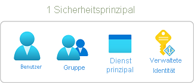

# Schritte zum Hinzufügen einer Rollenzuweisung

[!INCLUDE [Azure RBAC definition grant access](../../includes/role-based-access-control-definition-grant.md)] In diesem Artikel werden die allgemeinen Schritte zum Hinzufügen einer Rollenzuweisung mit [Azure-Portal](role-assignments-portal.md), [Azure PowerShell](role-assignments-powershell.md), [Azure CLI](role-assignments-cli.md) oder [REST-API](role-assignments-rest.md) beschrieben.

## Schritt 1: Ermitteln, wer Zugriff benötigt

Zuerst müssen Sie feststellen, wer Zugriff benötigt. Sie können eine Rolle einem Benutzer, einer Gruppe, einem Dienstprinzipal oder einer verwalteten Identität zuweisen. Dies wird auch als *Sicherheitsprinzipal* bezeichnet.

- Benutzer: eine Person, die über ein Profil in Azure Active Directory verfügt. Sie können auch bei anderen Mandanten Rollen zu Benutzern zuweisen. Weitere Informationen zu Benutzern in anderen Organisationen finden Sie unter [Azure Active Directory B2B](../active-directory/external-identities/what-is-b2b.md).
- Gruppe: eine Reihe von Benutzern, die in Azure Active Directory erstellt wurden. Wenn Sie einer Gruppe eine Rolle zuweisen, verfügen alle Benutzer in dieser Gruppe über diese Rolle. 
- Dienstprinzipal: eine Sicherheitsidentität, die von Anwendungen oder Diensten für den Zugriff auf bestimmte Azure-Ressourcen verwendet wird. Sie können sich diesen als *Benutzeridentität* (Benutzername und Kennwort oder Zertifikat) für eine Anwendung vorstellen.
- Verwaltete Identität: Eine Identität in Azure Active Directory, die automatisch von Azure verwaltet wird. In der Regel verwenden Sie [verwaltete Identitäten](../active-directory/managed-identities-azure-resources/overview.md) bei der Entwicklung von Cloudanwendungen, um die Anmeldeinformationen für die Authentifizierung bei Azure-Diensten zu verwalten.

## Schritt 2: Suchen der gewünschten Rolle

Berechtigungen sind in einer *Rollendefinition* zusammengefasst. Sie wird in der Regel einfach *Rolle* genannt. Sie können aus einer Liste von verschiedene vordefinierten Rollen auswählen. Wenn die integrierten Rollen den besonderen Ansprüchen Ihrer Organisation nicht genügen, können Sie Ihre eigenen benutzerdefinierten Rollen erstellen.

Im Folgenden werden vier grundlegende integrierte Rollen aufgeführt. Die ersten drei Rollen gelten für alle Ressourcentypen.

- [Besitzer](built-in-roles.md#owner) verfügen über vollständigen Zugriff auf alle Ressourcen, einschließlich des Rechts, den Zugriff an andere Personen zu delegieren.
- [Mitwirkende](built-in-roles.md#contributor) können alle Arten von Azure-Ressourcen erstellen und verwalten, aber keinen anderen Personen Zugriff gewähren.
- [Leser](built-in-roles.md#reader) können vorhandene Azure-Ressourcen anzeigen.
- Mit einem [Benutzerzugriffsadministrator](built-in-roles.md#user-access-administrator) können Sie den Benutzerzugriff auf Azure-Ressourcen verwalten.

Die verbleibenden integrierten Rollen ermöglichen die Verwaltung bestimmter Azure-Ressourcen. Mit der Rolle [Mitwirkender von virtuellen Computern](built-in-roles.md#virtual-machine-contributor) können Benutzer beispielsweise virtuelle Computer erstellen und verwalten.

1. Beginnen Sie mit dem umfassenden Artikel [Integrierte Azure-Rollen](built-in-roles.md). Die Tabelle am Anfang des Artikels stellt einen Index für die Details weiter unten in diesem Artikel dar.

1. Navigieren Sie in diesem Artikel zur Dienstkategorie (z. B. Compute, Speicher, Datenbanken) für die Ressource, der Sie Berechtigungen erteilen möchten. Die einfachste Möglichkeit, das Gesuchte zu finden, ist die Suche nach einem relevanten Schlüsselwort, etwa „Blob“, „virtueller Computer“ usw.

1. Überprüfen Sie die Rollen, die für die Dienstkategorie aufgeführt werden, und identifizieren Sie die jeweils erforderlichen Vorgänge. Beginnen Sie auch hier immer mit der restriktivsten Rolle.

    Wenn ein Sicherheitsprinzipal z. B. Blobs in einem Azure Storage-Konto lesen muss, aber keinen Schreibzugriff benötigt, wählen Sie [Storage-Blobdatenleser](built-in-roles.md#storage-blob-data-reader) anstelle von [Mitwirkender an Storage-Blobdaten](built-in-roles.md#storage-blob-data-contributor) (und definitiv nicht die Rolle [Besitzer von Speicherblobdaten](built-in-roles.md#storage-blob-data-owner) auf Administratorebene) aus. Sie können die Rollenzuweisungen später jederzeit nach Bedarf aktualisieren.

1. Wenn Sie keine geeignete Rolle finden, können Sie eine [benutzerdefinierte Rolle](custom-roles.md) erstellen.

## Schritt 3: Ermitteln des erforderlichen Bereichs

Ein *Bereich* ist der für den Zugriff geltende Ressourcensatz. In Azure können Sie auf vier Ebenen einen Bereich angeben: [Verwaltungsgruppe](../governance/management-groups/overview.md), Abonnement, [Ressourcengruppe](../azure-resource-manager/management/overview.md#resource-groups) und Ressource. Bereiche sind in einer Beziehung zwischen über- und untergeordneten Elementen strukturiert. Mit jeder Hierarchieebene wird der Bereich spezifischer. Sie können Rollen auf jeder dieser Bereichsebenen zuweisen. Die von Ihnen ausgewählte Ebene bestimmt, wie umfassend die Rolle angewendet wird. Niedrigere Ebenen erben die Rollenberechtigungen von höheren Ebenen. 

Wenn Sie eine Rolle in einem übergeordneten Bereich zuweisen, werden diese Berechtigungen an die untergeordneten Bereiche vererbt. Beispiel:

- Wenn Sie die Rolle [Leser](built-in-roles.md#reader) einem Benutzer im Bereich der Verwaltungsgruppe zuweisen, kann dieser Benutzer alles in allen Abonnements in der Verwaltungsgruppe lesen.
- Wenn Sie einer Gruppe im Abonnementbereich die Rolle [Abrechnungsleser](built-in-roles.md#billing-reader) zuweisen, können die Mitglieder dieser Gruppe Abrechnungsdaten für alle Ressourcengruppen und Ressourcen im Abonnement lesen.
- Wenn Sie einer Anwendung im Ressourcengruppenkontext die Rolle [Mitwirkender](built-in-roles.md#contributor) zuweisen, kann diese Ressourcen aller Typen in dieser Ressourcengruppe verwalten, jedoch keine anderen Ressourcengruppen des Abonnements.

 Weitere Informationen finden Sie unter [Grundlagen des Bereichs für Azure RBAC](scope-overview.md).

## Schritt 4. Überprüfen Ihrer Voraussetzungen

Zum Zuweisen von Rollen müssen Sie als Benutzer angemeldet sein, dem eine Rolle mit Schreibberechtigung für Rollenzuweisungen zugewiesen ist, z. B. [Besitzer](built-in-roles.md#owner) oder [Benutzerzugriffsadministrator](built-in-roles.md#user-access-administrator) in dem Bereich, in dem Sie die Rolle zuweisen möchten. Ebenso müssen Sie zum Entfernen einer Rollenzuweisung über die Berechtigung zum Löschen von Rollenzuweisungen verfügen.

- `Microsoft.Authorization/roleAssignments/write`
- `Microsoft.Authorization/roleAssignments/delete`

Wenn Ihr Benutzerkonto nicht über Berechtigungen zum Zuweisen einer Rolle in Ihrem Abonnement verfügt, wird eine Fehlermeldung mit dem Hinweis angezeigt, dass Ihr Konto keine Berechtigung zum Ausführen der Aktion „Microsoft.Authorization/roleAssignments/write“ besitzt. Wenden Sie sich in diesem Fall an die Administratoren Ihres Abonnements, da sie die Berechtigungen in Ihrem Namen zuweisen können.

## Schritt 5: Rollenzuweisung hinzufügen

Sobald Sie den Sicherheitsprinzipal, die Rolle und den Bereich kennen, können Sie die Rolle zuweisen. Sie können über das Azure-Portal, Azure PowerShell, die Azure-Befehlszeilenschnittstelle, Azure SDKs oder REST-APIs Rollenzuweisungen erstellen. Sie können in jedem Abonnement bis zu **2000** Rollenzuweisungen haben. Dieser Grenzwert schließt Rollenzuweisungen im Abonnement, in der Ressourcengruppe und im Ressourcenbereich ein. Jede Verwaltungsgruppe kann bis zu **500** Rollenzuweisungen enthalten.

In den folgenden Artikeln finden Sie ausführliche Schritte zum Hinzufügen von Rollenzuweisungen.

- [Hinzufügen oder Entfernen von Azure-Rollenzuweisungen über das Azure-Portal](role-assignments-portal.md)
- [Hinzufügen oder Entfernen von Azure-Rollenzuweisungen mithilfe von Azure PowerShell](role-assignments-powershell.md)
- [Hinzufügen oder Entfernen von Azure-Rollenzuweisungen mithilfe der Azure-Befehlszeilenschnittstelle](role-assignments-cli.md)
- [Hinzufügen oder Entfernen von Rollenzuweisungen mithilfe von Azure RBAC und der REST-API](role-assignments-rest.md)

## Nächste Schritte

- [Tutorial: Gewähren des Zugriffs auf Azure-Ressourcen für einen Benutzer mit dem Azure-Portal](quickstart-assign-role-user-portal.md)