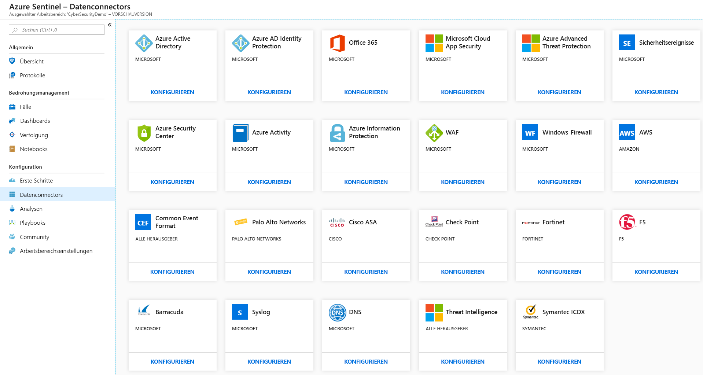

# Herstellen einer Verbindung mit Datenquellen

> [!IMPORTANT]
> Azure Sentinel ist derzeit als öffentliche Vorschauversion (Public Preview) verfügbar.
> Diese Vorschauversion wird ohne Vereinbarung zum Servicelevel bereitgestellt und ist nicht für Produktionsworkloads vorgesehen. Manche Features werden möglicherweise nicht unterstützt oder sind nur eingeschränkt verwendbar. Weitere Informationen finden Sie unter [Zusätzliche Nutzungsbestimmungen für Microsoft Azure-Vorschauen](https://azure.microsoft.com/support/legal/preview-supplemental-terms/).

Zum Integrieren von Azure Sentinel müssen Sie zuerst eine Verbindung mit Ihren Datenquellen herstellen. Azure Sentinel enthält eine Reihe von Connectors für Microsoft-Lösungen, die vorkonfiguriert verfügbar sind und Echtzeitintegration bieten, u. a. für Microsoft Threat Protection-Lösungen und Microsoft 365-Quellen (darunter Office 365, Azure AD, Azure ATP, Microsoft Cloud App Security usw.). Außerdem stehen integrierte Connectors für Sicherheitslösungen von anderen Anbietern als Microsoft zur Verfügung. Sie können auch Common Event Format (CEF), Syslog oder eine REST-API verwenden, um Ihre Datenquellen mit Azure Sentinel zu verbinden.  

## Datenverbindungsmethoden

Die folgenden Datenverbindungsmethoden werden von Azure Sentinel unterstützt:

- **Microsoft-Dienste**:  Microsoft-Dienste werden nativ verbunden und nutzen die Azure-Basiskomponenten für die sofortige Integration. Die folgenden Lösungen können mit wenigen Klicks verbunden werden:
    - [Office 365](connect-office-365.md)
    - [Azure AD-Überwachungsprotokolle und -Anmeldungen](connect-azure-active-directory.md)
    - [Azure-Aktivität](connect-azure-activity.md)
    - [Azure AD Identity Protection](connect-azure-ad-Identity-protection.md)
    - [Azure Security Center](connect-azure-security-center.md)
    - [Azure Information Protection](connect-azure-information-protection.md)
    - [Azure Advanced Threat Protection](connect-azure-atp.md)
    - [Cloud App Security](connect-cloud-app-security.md)
    - [Windows-Sicherheitsereignisse](connect-windows-security-events.md) 
    - [Windows-Firewall](connect-windows-firewall.md)

- **Externe Lösungen per API**: Einige Datenquellen werden mit APIs verbunden, die von der verbundenen Datenquelle bereitgestellt werden. Normalerweise werden bei den meisten Sicherheitstechnologien verschiedene APIs bereitgestellt, über die Ereignisprotokolle abgerufen werden können. Mit den APIs wird eine Verbindung mit Azure Sentinel hergestellt, und es werden bestimmte Datentypen erfasst und an Azure Log Analytics gesendet. Per API verbundene Appliances sind:
    - [Barracuda](connect-barracuda.md)
    - [Symantec](connect-symantec.md)
- **Externe Lösungen per Agent**: Azure Sentinel kann mit allen anderen Datenquellen verbunden werden, über die Echtzeit-Protokollstreaming per Syslog-Protokoll durchgeführt werden kann, indem ein Agent verwendet wird.  Für die meisten Appliances wird das Syslog-Protokoll zum Senden von Nachrichten genutzt, die das eigentliche Protokoll und die Daten zum Protokoll enthalten. Das Format der Protokolle variiert, aber die meisten Appliances unterstützen den CEF-Standard (Common Event Format).  Der Azure Sentinel-Agent, der auf dem Microsoft Monitoring Agent basiert, konvertiert Protokolle im CEF-Format in ein Format, das von Log Analytics erfasst werden kann. Je nach Appliancetyp wird der Agent entweder direkt auf der Appliance oder auf einem dedizierten Linux-Server installiert. Der Agent für Linux empfängt Ereignisse vom Syslog-Daemon per UDP. Falls für einen Linux-Computer aber die Erfassung einer großen Menge von Syslog-Ereignissen erwartet wird, werden diese per TCP über den Syslog-Daemon an den Agent und von dort an Log Analytics gesendet.
    - Firewalls, Proxys und Endpunkte:
        - [F5](connect-f5.md)
        - [Check Point](connect-checkpoint.md)
        - [Cisco ASA](connect-cisco.md)
        - [Fortinet](connect-fortinet.md)
        - [Palo Alto](connect-paloalto.md)
        - [Andere CEF-Appliances](connect-common-event-format.md)
        - [Andere Syslog-Appliances](connect-syslog.md)
    - DLP-Lösungen
    - [Threat Intelligence-Anbieter](connect-threat-intelligence.md)
    - [DNS-Computer](connect-dns.md): Der Agent wird direkt auf dem DNS-Computer installiert.
    - Linux-Server
    - Andere Clouds
    
## Agent-Verbindungsoptionen

Zum Verbinden Ihrer externen Appliance mit Azure Sentinel muss der Agent auf einem dedizierten Computer (VM oder lokal) bereitgestellt werden, um die Kommunikation zwischen der Appliance und Azure Sentinel zu unterstützen. Sie können den Agent automatisch oder manuell bereitstellen. Die automatische Bereitstellung ist nur verfügbar, wenn es sich bei Ihrem dedizierten Computer um einen neuen virtuellen Computer handelt, den Sie in Azure erstellen. 

Alternativ hierzu können Sie den Agent manuell auf einem vorhandenen virtuellen Azure-Computer, einem virtuellen Computer in einer anderen Cloud oder einem lokalen Computer bereitstellen.

## Nächste Schritte

- Für den Einstieg in Azure Sentinel benötigen Sie ein Microsoft Azure-Abonnement. Wenn Sie nicht über ein Abonnement verfügen, können Sie sich für ein [kostenloses Testabonnement](https://azure.microsoft.com/free/)registrieren.
- Hier erfahren Sie, wie Sie [Ihre Daten in Azure Sentinel integrieren](quickstart-onboard.md) und [Einblicke in Daten und potenzielle Bedrohungen erhalten](quickstart-get-visibility.md).
