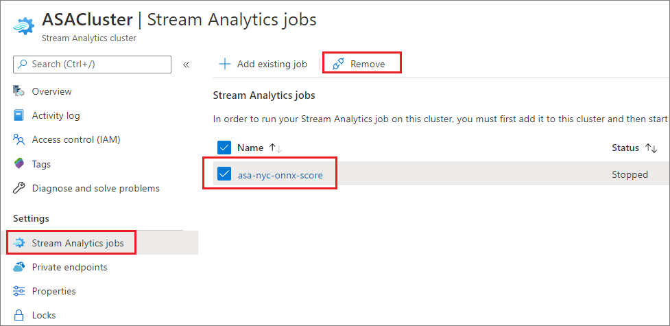

# Hinzufügen und Entfernen von Aufträgen in einem Azure Stream Analytics-Cluster

Sie können mehrere Azure Stream Analytics-Aufträge in einem Stream Analytics-Cluster ausführen. Das Ausführen von Aufträgen in einem Cluster ist ein einfacher Prozess mit zwei Schritten: Sie fügen dem Cluster den Auftrag hinzu und starten diesen. In diesem Artikel wird gezeigt, wie Sie Aufträge zu einem vorhandenen Cluster hinzufügen und daraus entfernen. Befolgen Sie die Schnellstartanleitung, um [einen Stream Analytics-Cluster](create-cluster.md) zu erstellen, wenn Sie nicht bereits über einen verfügen.

## Hinzufügen eines Stream Analytics-Auftrags zu einem Cluster

Nur vorhandene Stream Analytics-Aufträge können zu Clustern hinzugefügt werden. Befolgen Sie die Schnellstartanleitung, um zu erfahren, wie Sie mithilfe des Azure-Portals [einen Auftrag erstellen](stream-analytics-quick-create-portal.md). Wenn Sie über einen Auftrag verfügen, den Sie einem Cluster hinzufügen möchten, führen Sie die folgenden Schritte aus, um den Auftrag dem Cluster hinzuzufügen.

1. Suchen Sie im Azure-Portal nach Ihrem Stream Analytics-Cluster, und klicken Sie auf diesen.

1. Klicken Sie unter **Einstellungen** auf **Stream Analytics-Aufträge**. Klicken Sie dann auf **Add existing job** (Vorhandenen Auftrag hinzufügen).

1. Wählen Sie das Abonnement und den Stream Analytics-Auftrag aus, den Sie dem Cluster hinzufügen möchten. Dem Cluster können nur Stream Analytics-Aufträge hinzugefügt werden, die sich am gleichen Speicherort wie der Cluster befinden.

   

1. Nachdem Sie den Auftrag dem Cluster hinzugefügt haben, navigieren Sie zu der Auftragsressource, und [starten Sie den Auftrag](start-job.md#azure-portal). Der Auftrag wird dann in Ihrem Cluster ausgeführt.

Sie können alle anderen Vorgänge wie beispielsweise Überwachungs-, Warnungs- und Diagnoseprotokolle über die Stream Analytics-Seite für Auftragsressourcen ausführen.

## Entfernen eines Stream Analytics-Auftrags aus einem Cluster

Stream Analytics-Aufträge müssen beendet werden, bevor sie aus dem Cluster entfernt werden können. Wenn der Auftrag noch ausgeführt wird, beenden Sie ihn, bevor Sie mit den folgenden Schritten fortfahren.

1. Suchen Sie Ihren Stream Analytics-Cluster, und wählen Sie ihn aus.

1. Klicken Sie unter **Einstellungen** auf **Stream Analytics-Aufträge**.

1. Wählen Sie die Aufträge aus, die Sie aus dem Cluster entfernen möchten, und klicken Sie auf **Entfernen**.

   

   Wenn ein Auftrag aus einem Stream Analytics-Cluster entfernt wird, wird er zurück in die Standardumgebung mit mehreren Mandanten verschoben.

## Nächste Schritte

Sie wissen jetzt, wie Sie Aufträge in Ihrem Azure Stream Analytics-Cluster hinzufügen und entfernen. Als Nächstes erfahren Sie, wie Sie private Endpunkte verwalten und Ihre Cluster skalieren:

* [Skalieren eines Azure Stream Analytics-Clusters](scale-cluster.md)
* [Verwalten privater Endpunkte in einem Azure Stream Analytics-Cluster](private-endpoints.md)
