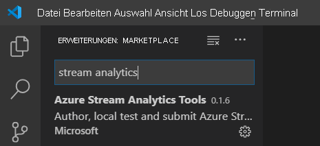
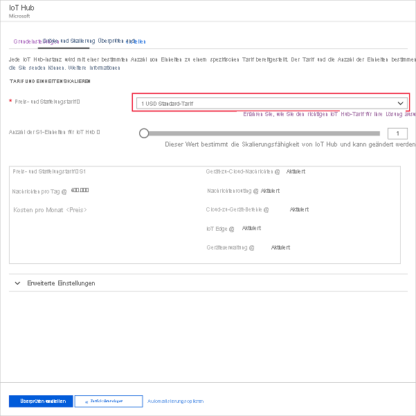
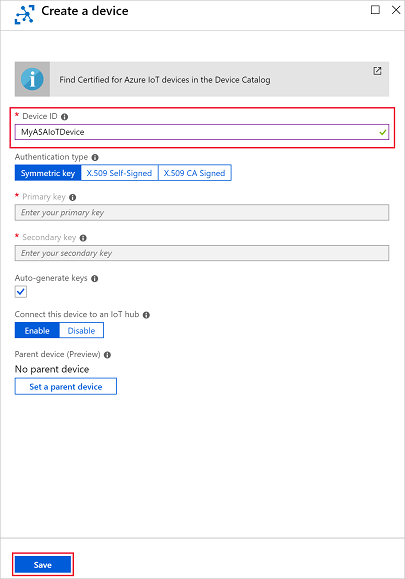
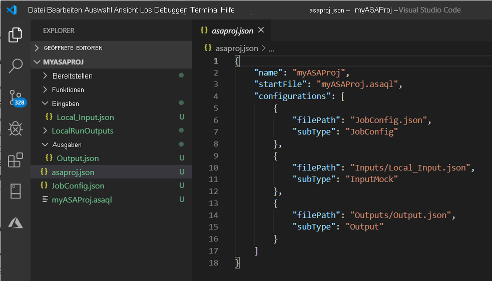
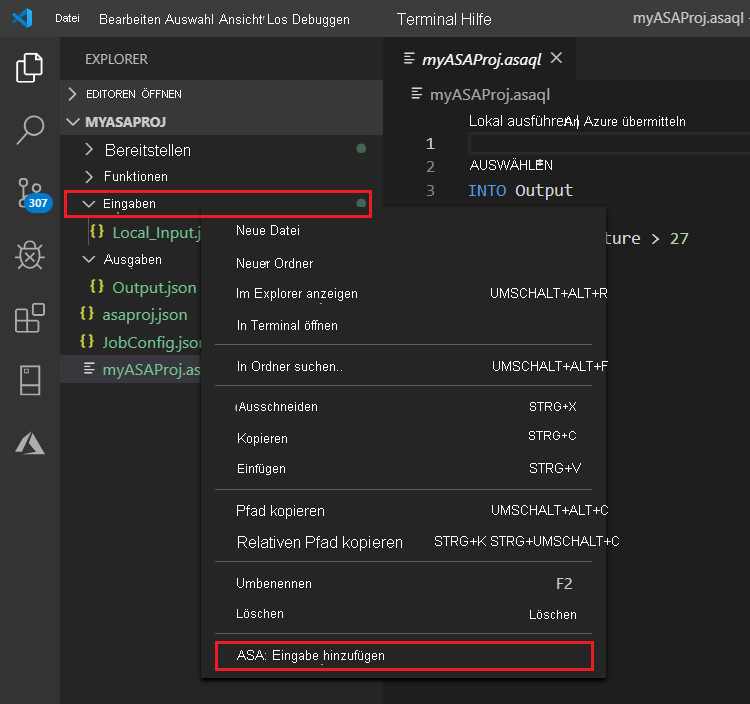
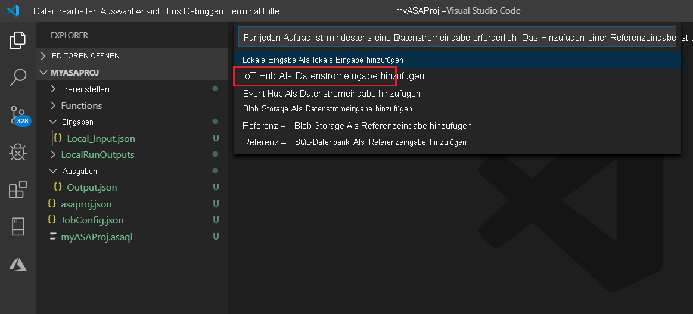
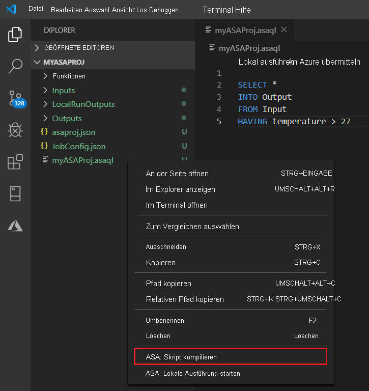
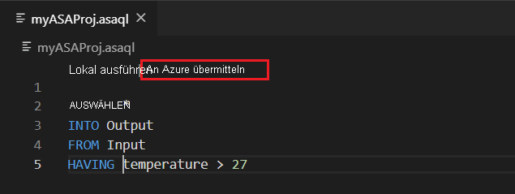
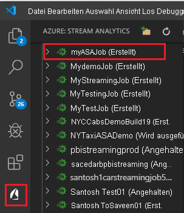
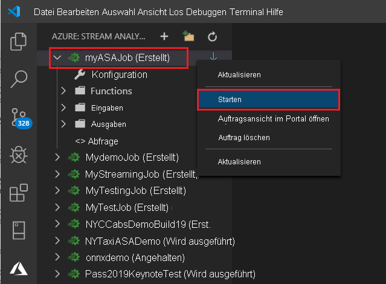

# <a name="quickstart-create-an-azure-stream-analytics-job-in-visual-studio-code-preview"></a>Schnellstart: Erstellen eines Azure Stream Analytics-Auftrags in Visual Studio Code (Vorschauversion)

In dieser Schnellstartanleitung wird gezeigt, wie Sie mithilfe einer Azure Stream Analytics-Tools-Erweiterung für Visual Studio Code einen Azure Stream Analytics-Auftrag erstellen und ausführen. Der Beispielauftrag liest Streamingdaten von einem Azure IoT Hub-Gerät. Sie legen einen Auftrag fest, der bei Überschreitung von 27 Grad die Durchschnittstemperatur berechnet und die entsprechenden Ausgabeereignisse in eine neue Datei im Blobspeicher schreibt.

> [!NOTE]
> Visual Studio und Visual Studio Code Tools unterstützen keine Aufträge in den Regionen „China, Osten“, „China, Norden“, „Deutschland, Mitte“ oder „Deutschland, Nordosten“.

## <a name="before-you-begin"></a>Voraussetzungen

* Wenn Sie kein Azure-Abonnement besitzen, können Sie ein [kostenloses Konto](https://azure.microsoft.com/free/) erstellen.

* Melden Sie sich beim [Azure-Portal](https://portal.azure.com/) an.

* Installieren Sie [Visual Studio Code](https://code.visualstudio.com/).

## <a name="install-the-azure-stream-analytics-tools-extension"></a>Installieren der Azure Stream Analytics-Tools-Erweiterung

1. Öffnen Sie Visual Studio Code.

2. Suchen Sie in **Erweiterungen** im linken Bereich nach **Stream Analytics** , und wählen Sie in der **Azure Stream Analytics-Tools** -Erweiterung **Installieren** aus.

3. Sobald die Erweiterung installiert ist, überprüfen Sie, ob **Azure Stream Analytics-Tools** unter **Aktivierte Erweiterungen** sichtbar ist.

   

## <a name="activate-the-azure-stream-analytics-tools-extension"></a>Aktivieren der Azure Stream Analytics-Tools-Erweiterung

1. Wählen Sie auf der Aktivitätsleiste von Visual Studio Code das **Azure** -Symbol aus. Wählen Sie auf der Seitenleiste unter **Stream Analytics** **Bei Azure anmelden** aus.

   

2. Wenn Sie angemeldet sind, wird der Name Ihres Azure-Kontos auf der Statusleiste in der linken unteren Ecke des Visual Studio Code-Fensters angezeigt.

> [!NOTE]
> Die Azure Stream Analytics-Tools-Erweiterung führt die Anmeldung beim nächsten Mal automatisch durch, wenn Sie sich nicht abmelden. Wenn Ihr Konto über zweistufige Authentifizierung verfügt, empfehlen wir anstelle einer PIN die Verwendung der Telefonauthentifizierung.
> Wenn beim Auflisten von Ressourcen Probleme auftreten, lässt sich das meistens durch Abmelden und erneutes Anmelden beheben. Geben Sie zum Abmelden den Befehl `Azure: Sign Out` ein.

## <a name="prepare-the-input-data"></a>Vorbereiten der Eingabedaten

Vor dem Definieren des Stream Analytics-Auftrags sollten Sie die Daten vorbereiten, die später als Auftragseingabe konfiguriert werden. Führen Sie die folgenden Schritte aus, um die für den Auftrag erforderlichen Eingabedaten vorzubereiten:

1. Melden Sie sich beim [Azure-Portal](https://portal.azure.com/) an.

2. Wählen Sie **Ressource erstellen** > **Internet der Dinge (IoT)**  > **IoT Hub** aus.

3. Geben Sie im Bereich **IoT Hub** die folgenden Informationen ein:

   |**Einstellung**  |**Empfohlener Wert**  |**Beschreibung**  |
   |---------|---------|---------|
   |Subscription  | \<Your subscription\> |  Wählen Sie das gewünschte Azure-Abonnement aus. |
   |Ressourcengruppe   |   asaquickstart-resourcegroup  |   Wählen Sie **Neu erstellen** aus, und geben Sie einen neuen Ressourcengruppennamen für Ihr Konto ein. |
   |Region  |  \<Select the region that is closest to your users\> | Wählen Sie einen geografischen Standort aus, an dem Sie Ihre IoT Hub-Instanz hosten können. Verwenden Sie den Standort, der Ihren Benutzern am nächsten ist. |
   |IoT Hub-Name  | MyASAIoTHub  |   Wählen Sie einen Namen für Ihre IoT Hub-Instanz aus.   |

   

4. Klicken Sie auf **Weiter: Set size and scale** (Größe und Skalierung festlegen).

5. Treffen Sie eine Auswahl für **Preis- und Staffelungstarif**. Legen Sie für diese Schnellstartanleitung den Tarif **F1 – Free** fest, wenn er für Ihr Abonnement noch verfügbar ist. Falls der Tarif „Free“ nicht verfügbar ist, sollten Sie den niedrigsten verfügbaren Tarif wählen. Weitere Informationen finden Sie unter [Azure IoT Hub – Preise](https://azure.microsoft.com/pricing/details/iot-hub/).

   

6. Klicken Sie auf **Überprüfen + erstellen**. Überprüfen Sie die Informationen zu IoT Hub, und wählen Sie **Erstellen** aus. Die Erstellung des IoT Hubs kann mehrere Minuten dauern. Sie können den Fortschritt im Bereich **Benachrichtigungen** überwachen.

7. Wählen Sie in Ihrem IoT Hub-Navigationsmenü unter **IoT-Geräte** die Option **Hinzufügen** aus. Fügen Sie eine ID für **Geräte-ID** hinzu, und wählen Sie **Speichern** aus.

   

8. Öffnen Sie das Gerät nach der Erstellung in der Liste **IoT-Geräte**. Kopieren Sie die Zeichenfolge in **Verbindungszeichenfolge (primärer Schlüssel)** , und speichern Sie sie zur späteren Verwendung in einem Editor.

   

## <a name="run-the-iot-simulator"></a>Ausführen des IoT-Simulators

1. Öffnen Sie den [Raspberry Pi Azure IoT Online Simulator](https://azure-samples.github.io/raspberry-pi-web-simulator/) über eine neue Browserregisterkarte oder ein neues Fenster.

2. Ersetzen Sie den Platzhalter in Zeile 15 durch die Verbindungszeichenfolge für das IoT Hub-Gerät, die Sie zuvor gespeichert haben.

3. Klicken Sie auf **Run** (Ausführen). In der Ausgabe sollten nun die Sensordaten und -nachrichten angezeigt werden, die an Ihre IoT Hub-Instanz gesendet werden.

   

## <a name="create-blob-storage"></a>Erstellen eines Blobspeichers

1. Wählen Sie in der linken oberen Ecke des Azure-Portals **Ressource erstellen** > **Speicher** > **Speicherkonto** aus.

2. Geben Sie im Bereich **Speicherkonto erstellen** einen Speicherkontonamen, den Standort und die Ressourcengruppe ein. Wählen Sie den gleichen Speicherort und die gleiche Ressourcengruppe wie für die von Ihnen erstellte IoT Hub-Instanz aus. Wählen Sie dann zum Erstellen des Kontos **Überprüfen + erstellen** aus.

   

3. Wählen Sie nach der Erstellung des Speicherkontos im Bereich **Übersicht** die Kachel **Blobs** aus.

   

4. Wählen Sie auf der Seite **Blob-Dienst** die Option **Container** aus, und geben Sie einen Namen für Ihren Container (etwa **container1** ) ein. Übernehmen Sie für **Öffentliche Zugriffsebene** die Option **Privat (kein anonymer Zugriff)** , und wählen Sie **OK** aus.

   

## <a name="create-a-stream-analytics-project"></a>Erstellen eines Stream Analytics-Projekts

1. Wählen Sie in Visual Studio Code **STRG+UMSCHALT+P** aus, um die Befehlspalette zu öffnen. Geben Sie dann **ASA** ein, und wählen Sie **ASA: Neues Projekt erstellen** aus.

   

2. Geben Sie Ihren Projektnamen ein, z. B. **myASAproj** , und wählen Sie einen Ordner für Ihr Projekt aus.

    

3. Das neue Projekt wird Ihrem Arbeitsbereich hinzugefügt. Ein Stream Analytics-Projekt besteht aus drei Ordnern: **Inputs** , **Outputs** und **Functions**. Es verfügt außerdem über das Abfrageskript **(*.asaql)** , eine **JobConfig.json** -Datei, und eine **asaproj.json** -Konfigurationsdatei.

    Die **asaproj.json** -Konfigurationsdatei enthält die Eingaben, Ausgaben und Auftragskonfigurationsdatei-Informationen, die für die Übermittlung des Stream Analytics-Auftrags an Azure erforderlich sind.

    

> [!Note]
> Beim Hinzufügen von Eingaben und Ausgaben aus der Befehlspalette werden die entsprechenden Pfade automatisch **asaproj.json** hinzugefügt. Wenn Sie Eingaben oder Ausgaben direkt auf einem Datenträger hinzufügen oder entfernen, müssen Sie sie manuell zu **asaproj.json** hinzufügen bzw. aus ihr entfernen. Sie können sich auch entscheiden, die Eingaben und Ausgaben an einem Ort zu versammeln und dann in verschiedenen Aufträgen auf sie verweisen, indem Sie in jeder **asaproj.json** -Datei die Pfade angeben.

## <a name="define-the-transformation-query"></a>Definieren der Transformationsabfrage

1. Öffnen Sie **myASAproj.asaql** aus Ihrem Projektordner.

2. Fügen Sie die folgende Abfrage hinzu:

   ```sql
   SELECT *
   INTO Output
   FROM Input
   HAVING Temperature > 27
   ```

## <a name="define-a-live-input"></a>Definieren einer Liveeingabe

1. Klicken Sie im Stream Analytics-Projekt mit der rechten Maustaste auf den Ordner **Inputs**. Wählen Sie anschließend **ASA: Eingabe hinzufügen** im Kontextmenü aus.

    

    Wählen Sie alternativ **STRG+UMSCHALT+P** aus, um die Befehlspalette zu öffnen, und geben Sie **ASA: Eingabe hinzufügen** ein.

   

2. Wählen Sie als Eingabetyp **IoT Hub** aus.

   

3. Wenn Sie die Eingabe über die Befehlspalette hinzugefügt haben, wählen Sie das Stream Analytics-Abfrageskript aus, von dem die Eingabe verwendet werden soll. Es sollte automatisch mit dem Dateipfad zu **myASAproj.asaql** aufgefüllt werden.

   

4. Wählen Sie im Dropdownmenü die Option **Aus Ihren Azure-Abonnements auswählen** aus.

    

5. Bearbeiten Sie die neu generierte **IoTHub1.json** -Datei mit den folgenden Werten. Behalten Sie die Standardwerte für Felder bei, die hier nicht aufgeführt sind.

   |Einstellung|Vorgeschlagener Wert|Beschreibung|
   |-------|---------------|-----------|
   |Name|Eingabe|Geben Sie einen Namen zur Identifizierung der Eingabe des Auftrags ein.|
   |IotHubNamespace|MyASAIoTHub|Wählen Sie den Namen Ihrer IoT Hub-Instanz aus, oder geben Sie ihn ein. IoT Hub-Namen werden automatisch erkannt, wenn sie unter demselben Abonnement erstellt werden.|
   |SharedAccessPolicyName|iothubowner| |

   Sie können das CodeLens-Feature verwenden, um sich bei der Eingabe einer Zeichenfolge, der Auswahl aus einer Dropdownliste oder direkten Änderungen von Text in der Datei unterstützen zu lassen. Der folgende Screenshot zeigt **Select from your Subscriptions** (Aus Ihren Abonnements auswählen) als Beispiel. Die Anmeldeinformationen werden automatisch aufgelistet und in der lokalen Anmeldeinformationsverwaltung gespeichert.

   

   

## <a name="preview-input"></a>Anzeigen einer Eingabevorschau

Wählen Sie **Datenvorschau** in der obersten Zeile von **IoTHub1.json** aus. Es werden einige Eingabedaten aus der IoT Hub-Instanz abgerufen und im Vorschaufenster angezeigt. Dieser Vorgang kann etwas dauern.

 

## <a name="define-an-output"></a>Definieren einer Ausgabe

1. Wählen Sie **STRG+UMSCHALT+P** aus, um die Befehlspalette zu öffnen. Geben Sie dann **ASA: Ausgabe hinzufügen** ein.

   

2. Wählen Sie als Senkentyp **Blob Storage** aus.

3. Wählen Sie das Stream Analytics-Abfrageskript aus, das diese Eingabe verwenden soll.

4. Geben Sie als Namen der Ausgabedatei **BlobStorage** ein.

5. Bearbeiten Sie **BlobStorage** mit den folgenden Werten. Behalten Sie die Standardwerte für Felder bei, die hier nicht aufgeführt sind. Das CodeLens-Feature unterstützt Sie beim Auswählen aus einer Dropdownliste oder beim Eingeben einer Zeichenfolge.

   |Einstellung|Vorgeschlagener Wert|Beschreibung|
   |-------|---------------|-----------|
   |Name|Output| Geben Sie einen Namen ein, um die Ausgabe des Auftrags kenntlich zu machen.|
   |Speicherkonto|asaquickstartstorage|Wählen Sie den Namen Ihres Speicherkontos aus, oder geben Sie ihn ein. Speicherkontonamen werden automatisch erkannt, wenn sie im gleichen Abonnement erstellt werden.|
   |Container|container1|Wählen Sie den vorhandenen Container aus, den Sie in Ihrem Speicherkonto erstellt haben.|
   |Pfadmuster|output|Geben Sie den Namen eines Dateipfads ein, der innerhalb des Containers erstellt werden soll.|

   

## <a name="compile-the-script"></a>Kompilieren des Skripts

Die Skriptkompilierung überprüft die Syntax und generiert die Azure Resource Manager-Vorlagen für die automatische Bereitstellung.

Es gibt zwei Möglichkeiten, die Skriptkompilierung auszulösen:

- Wählen Sie das Skript im Arbeitsbereich aus, und kompilieren Sie dann in der Befehlspalette.

   

- Klicken Sie mit der rechten Maustaste auf das Skript, und wählen Sie **ASA: Compile Script** ein.

    

Nach der Kompilierung finden Sie die zwei generierten Azure Resource Manager-Vorlagen im Ordner **Deploy** Ihres Projekts. Diese zwei Dateien werden für die automatische Bereitstellung verwendet.


## <a name="submit-a-stream-analytics-job-to-azure"></a>Übermitteln eines Stream Analytics-Auftrags an Azure

1. Wählen Sie im Skript-Editor-Fenster des Abfrageskripts **An Azure übermitteln** aus.

   

2. Wählen Sie in der Popupliste Ihr Abonnement aus.

3. Wählen Sie **Auftrag auswählen** aus. Wählen Sie dann **Neuen Auftrag erstellen** aus.

4. Geben Sie den Auftragsnamen **myASAjob** ein. Befolgen Sie dann die Anweisungen, um die Ressourcengruppe und den Speicherort auszuwählen.

5. Wählen Sie **An Azure übermitteln** aus. Sie finden die Protokolle im Ausgabefenster. 

6. Wenn der Auftrag erstellt wurde, wird er im **Stream Analytics-Explorer** angezeigt.

    

## <a name="start-the-stream-analytics-job-and-check-output"></a>Starten des Stream Analytics-Auftrags und Überprüfen der Ausgabe

1. Öffnen Sie den **Stream Analytics-Explorer** in Visual Studio Code, und suchen Sie Ihren Auftrag **myASAJob**.

2. Klicken Sie mit der rechten Maustaste auf den Auftragsnamen. Wählen Sie dann im Kontextmenü **Start** aus.

   

3. Wählen Sie im Popupfenster **Jetzt** aus, um den Auftrag zu starten.

4. Beachten Sie, dass sich der Auftragsstatus in **Wird ausgeführt** geändert hat. Klicken Sie mit der rechten Maustaste auf den Namen des Auftrags, und wählen Sie **Auftragsansicht im Portal öffnen** aus, um die Eingabe- und Ausgabeereignismetriken anzuzeigen. Diese Aktion kann einige Minuten dauern.

5. Um die Ergebnisse anzuzeigen, öffnen Sie den Blobspeicher in der Visual Studio Code-Erweiterung oder im Azure-Portal.

## <a name="clean-up-resources"></a>Bereinigen von Ressourcen

Löschen Sie die Ressourcengruppe, den Streamingauftrag und alle dazugehörigen Ressourcen, wenn Sie sie nicht mehr benötigen. Durch das Löschen des Auftrags verhindern Sie, dass die vom Auftrag verbrauchten Streamingeinheiten abgerechnet werden. 

Wenn Sie den Auftrag in Zukunft verwenden möchten, können Sie ihn beenden und später neu starten. Wenn Sie diesen Auftrag nicht mehr verwenden möchten, löschen Sie alle Ressourcen, die im Rahmen dieser Schnellstartanleitung erstellt wurden, mit folgenden Schritten:

1. Wählen Sie im Azure-Portal im Menü auf der linken Seite **Ressourcengruppen** und dann den Namen der erstellten Ressource aus.  

2. Wählen Sie auf der Ressourcengruppenseite die Option **Löschen** aus. Geben Sie den Namen der zu löschenden Ressourcengruppe in das Textfeld ein, und wählen Sie dann **Löschen** aus.

## <a name="next-steps"></a>Nächste Schritte

In dieser Schnellstartanleitung haben Sie einen einfachen Stream Analytics-Auftrag mit Visual Studio Code bereitgestellt. Stream Analytics-Aufträge können auch mit [Azure-Portal](stream-analytics-quick-create-portal.md), [PowerShell](stream-analytics-quick-create-powershell.md) und [Visual Studio](stream-analytics-quick-create-vs.md) bereitgestellt werden.

Informationen zu den Azure Stream Analytics-Tools für Visual Studio Code finden Sie in folgenden Artikeln:

* [Lokales Testen von Stream Analytics-Abfragen mit Beispieldaten mithilfe von Visual Studio Code](visual-studio-code-local-run.md)

* [Lokales Testen von Azure Stream Analytics-Aufträgen mit Liveeingabe unter Verwendung von Visual Studio Code](visual-studio-code-local-run-live-input.md)

* [Erkunden von Azure Stream Analytics mit Visual Studio Code (Vorschauversion)](visual-studio-code-explore-jobs.md)

* [Verwenden des CI/CD-npm-Pakets von Stream Analytics](./cicd-overview.md)